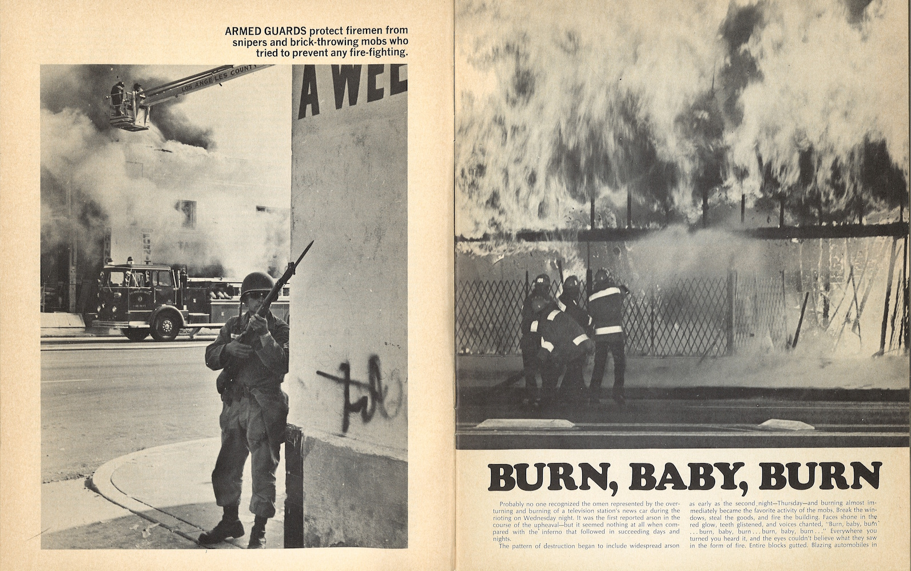

The 1965 Watts Riot occurred in early August in Los Angeles, California. An incident of police brutality sparked the riot. The uprising was a release of tension between African-American citizens and the Los Angeles Police Department (LAPD). Anarchy in Los Angeles is a single edition magazine that specifically covered the 1965 Watts Riots. Within the magazine, there are approximately over thirty pictures that fully capture the chaotic climate of the riots.

The magazine is filled with black and white photographs that capture visuals of burned buildings, flipped over cars, police officers with rifles, and battered African-American victims. Photograph 1 is a combination of several distinct images on one page. The image on the top left hand corner of the page display a group of four African-American individuals, two female and two male. On the other side of the image there are four Caucasian male police officers. One of the black males that centered in the middle of the image has blood on the side of his face, with his back turned towards the white male officers. The two females in the picture are seen comforting him by holding his hands and touching his face. The white male officer has a baton in his hands shoved towards the kidneys of the injured African-American male. All of the officers in the picture all have hard helmets on. Photograph 1 is similar to photograph 2 in that they both capture police brutality during the riots.

In photograph 2, Marquette Frye, a 21-year-old black man, was arrested for drunk driving in a Watts neighborhood. His mistreatment from police officers sparked off six days of rioting, resulting in thirty-four deaths, over a thousand injuries, nearly four thousand arrests, and the destruction of property valued at $40 million. When Fryes was arrested, hundreds of African-Americans from nearby communities had been drawn to the scene. Anger and rumors spread like wildfire through the black community. Inhabitants of the black community destroyed cars and beat Caucasians who entered the area. The Los Angeles County Human Relations Commission called a neighborhood meeting the following day which failed to put down the heightening tensions, and that evening rioting resumed. Firemen attempted to put out fires and were met with shooting from nearby residents, and uncontrollable looting. On Friday the riots escalated, forcing the California lieutenant governor to call in the National Guard. By Saturday night a curfew had been set, and nearly 14,000 National Guard troops were patrolling a 46-mile area.  By Sunday the riots had died down. Churches, community groups, and government agencies began to give out aid. The vandalism stopped and the curfew was lifted by August 17, the following Tuesday. A week later, less than 300 national guardsmen remained to help out with the aftermath of the riots. ‘‘What did Watts accomplish but the death of thirty-four Negroes and injury to thousands more? What did it profit the Negro to burn down the stores and factories in which he sought employment? The way of riots is not a way of progress, but a blind ally of death and destruction which wrecks its havoc hardest against the rioters themselves’’ (“Watts Rebellion (Los Angeles, 1965)”). The riots brought degradation to the city of Watts. Not much was accomplished after the riots and under Commander Parker’s rule, the LAPD became tougher on crime in the aftermath of the riots.

Photograph 3 contains a portrait of William H. Parker, the police chief of the Los Angeles Police Department (June 21, 1905– July 16, 1966). Under Parker, the LAPD faced accusations of police brutality and racial animosity towards the city's African American and Latino residents. Parker allegedly supported the city's racist power structure, which he denied as late as the 1960s. Longstanding mistreatment towards its residents eventually led to the Watts Riots.

Parker is credited with transforming the LAPD into a world-renowned law enforcement agency. The department that he took over in 1950 was notorious. Thus, he concluded that a different organized police force was necessary to keep the peace. Parker changed the police force from a walking-peace force to a more militarized mobile response force.

Though police departments have always been organized as military-style hierarchies, after the Watts Riots, the LAPD went beyond organization to mimic military tactics in the streets. A year after the 1965 Watts Riots, the LAPD invented the nation’s first SWAT team. The SWAT team consisted of expensively trained and equipped officers who are selected from volunteers within their law-enforcement organization. These officers carried military style weapons such as heavy, sophisticated gear and equipment. The SWAT officers used force maximally even in minor situations, which lead to a threatening and hostile demeanor toward the public, and a siege mentality in which the police dehumanize the citizens into enemies in a war. The optics presented in the magazine encapsulates racism, police brutality, violence, destruction, and segregation between African-American citizens and police officers.

**Bibliography**

Benson, Robert W. “Changing Police Culture: The Sin Qua Non of Reform.” HeinOnline (2000) Retrieved from <ref target="http://heinonline.org/HOL/Print?collection=journals&amp;handle=hein.journals/lla34&amp;id=713" type="url"> Hein Online </ref> on October 29, 2013 

“Watts Riots.” South Central History.  26 June 2012. <ref target="http://www.southcentralhistory.com/watts-riots.php" type="url"> southcentralhistory.com </ref>

“Watts Rebellion (Los Angeles, 1965).” Martin Luther King, Jr. And The Global Freedom Struggle. <ref target="http://mlk-kpp01.stanford.edu/index.php/encyclopedia/encyclopedia/enc_watts_rebellion_los_angeles_1965" type="url"> Watt's Rebellion </ref>

<figcaption>
Burn, Baby, Burn

<small>Committee for Simon Rodia's Towers in Watts, 1954-1992. Image courtesy of UCLA Library Special Collections.</small>

