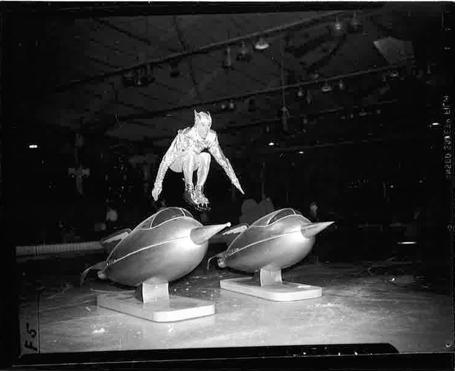

The Ice Follies was a very popular skating routine which included chorus girls, soloists, elaborate props, and production numbers. Founded in 1936 by brothers Eddie and Roy Shipstad, as well as Oscar Johnson, the group became known as the “Shipstad and Johnson Ice Follies”.  The three men skated in the show, as well as Olympic skaters from previous years. They taught themselves how to skate. Roy and Eddie decided to put on performances during intermissions of hockey games, which became very popular at the time. Sometimes the police would come in order to control the crowds that supported the skaters because they feared the people would fall through the ice.

The brothers formed a partnership together, and soon after Oscar decided to join forces with the two talented skaters. The three men skated together for the first time at a charity benefit. The first official performance known as the Ice Follies was on November 7, 1936 in Tulsa, Oklahoma. During the period from 1936 to 1979, the show experienced the majority of its success. It gave rise to many similar ice skating performers, such as the well-known “Ice Capades”. Soon these troupes of traveling ice skaters became a huge source of entertainment for Americans in all states.

The show featured amazing lighting, funny costumes, and fabulous dancing. Another wonderful part of the show was the performance by the chorus line called “The Ice Folliettes”. This group of women influenced what we know today as synchronized skating.

In 1939, the success of the Ice Follies inspired the production of a movie entitled The Ice Follies of 1939. The movie starred Joan Crawford, James Stewart, and Lew Ayres, and even included the founders of the Ice Follies. The movie was unsuccessful, but still provided promoted the success of not only the Ice Follies, but of all traveling ice shows.

Over time the Ice Follies lost their popularity. Fewer people would purchase tickets to watch the show, but the Ice Follies inspired the formation of other shows in years to come. In 1954, the partners sold the Ice Follies for $3.5 million dollars to become “Holiday on Ice,” and then eventually “Disney on Ice” which it still is today. What started out as a group of ice skaters performing on a frozen lake in Minnesota is today the head company in ice entertainment. Disney on Ice tours in more than 110 cities and twenty countries each year, perpetuating the legacy of the Shipstad brothers and Oscar Johnson.

<figcaption>
Ice Follies Dress Rehearsal

<small>1946. Image courtesy of UCLA Library Special Collections.</small>

