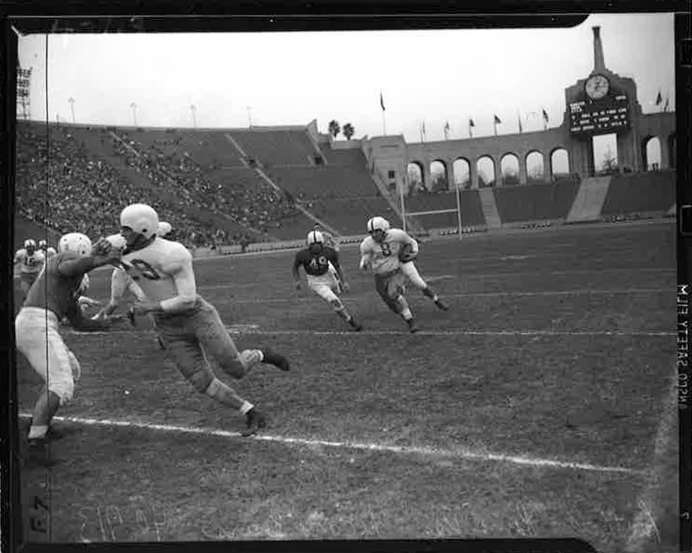
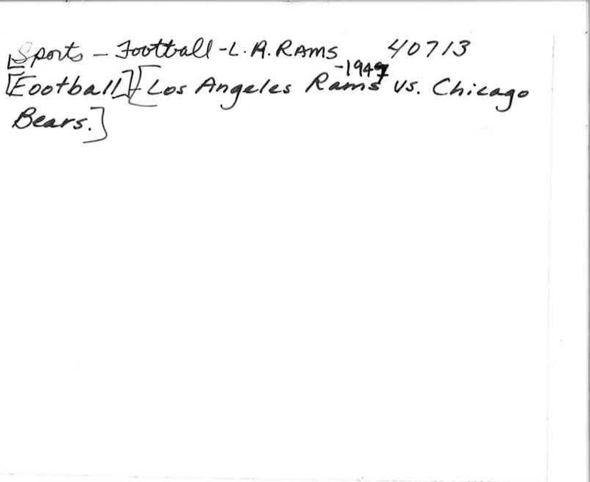

The artifact we chose from the Special Collections materials offered is a photograph1 of a National Football League game between the Los Angeles Rams and the Chicago Bears in 1947. The photograph shows a player running with the football and an opponent chasing him. Simultaneously, his teammate in front is running forwards, trying to avoid a defender. Behind the action on the field, there are stands for the audience. In addition, there are arches, each with a flag, that converge into a structure that supports the clock and scoreboard. The area in front of the arches is decorated with patches of well-trimmed grass. The field’s arches make it evident that the football stadium in the photograph is the Los Angeles Memorial Coliseum, because the arches are identical with the ones that distinguish the Coliseum from all other venues; however, compared to other venues in Los Angeles, the city is especially invested in the establishment and use of the Coliseum.

The Los Angeles Coliseum was designed in a unique manner by John and Donald Parkinson. The stadium is located in Southern Los Angeles, just off the 110 freeway; 3911 S Figueroa St, Los Angeles, California 90037. Construction began December 21, 1921 by the state of California and was completed in less than two years on May 1, 1923. The initial building cost was just under one million dollars. The Coliseum's bowl shape gave a small and intimate feel with fans all around. The 360-degree theater style seating has an isolated enclosure. The crowd is close to the field and therefore interaction and participation with the performers is encouraged. The stadium originally seated 75,000, which made it the largest in Los Angeles at the time. The natural colored, concrete, arched outer appearance is anything but modern. The architecture of the Los Angeles Memorial Coliseum gives a classic, traditional, historical, as well as European feel. However, since the 1920’s the venue has undergone multiple renovations.

The Coliseum has already been renovated multiple times to enhance its facilities for athletes, spectators, speakers and singers. The first change was an expansion for the 1932 Olympics. The stadium expanded to hold over 100,000 people to accommodate for the Games, which ultimately became an issue for a future National Football League (NFL) venue, but contributed to the University of Southern California (USC) acquiring the master lease. Due to the massive number of seats, the NFL was unable to sell out the stadium and in turn had to stop broadcasting its football games on television, because it reflected poorly on the franchise. Its size was reduced in 1964 to seat 94,000 and remains in this state today. Another major change came about after damage happened during the 1994 earthquake. Over $90 million dollars were spent fixing the damage as well as incorporating new press box seating. The Los Angeles Memorial Coliseum was built by California, but it is rented out primarily by USC along with other teams and organizations. In July of 2013, USC signed a lease for 100 years and agreed to maintaining a positive, clean, functional environment. The stadium will continue to undergo changes and modernization due to competition. As a PAC-12 school, USC has to continue to raise its standards. This begins with enhancing the facilities it offers to its recruits and student-athletes. The Los Angeles Coliseum was founded upon traditional appearance and maintains its modern upkeep in order to create a premier, functional environment for hosting a variety of events.

The Los Angeles Memorial Coliseum has mainly hosted a variety of sporting events since its opening day. The first memorable event that was held in the Coliseum was the 1932 Summer Olympics, because after the Olympics, the Coliseum was previously referred to as the Olympic Stadium. During the 1932 Olympic Games, the Coliseum hosted the opening and closing ceremonies as well as transformed into a venue for field hockey, gymnastics, equestrian, and track and field. Half a century later, the Coliseum played host again for the Summer Olympics in 1984, which made it the first stadium ever to host the Olympic Games twice; however, for the 1984 Olympics, the Coliseum served primarily as a venue for the opening and closing ceremonies as well as track and field. Nonetheless, the Coliseum was ideal for hosting football games due to its design and field dimensions; hence, it was the first site to host the Super Bowl on January 15, 1967. Six years later, the Super Bowl VII was also held in the Coliseum on January 14, 1973. The Coliseum played a frequent host to not only the Super Bowl, but also for National Football League games, because all the Californian professional football teams, excluding the San Francisco 49ers and including the Los Angeles Rams, the formerly known as Los Angeles Raiders, and the formerly known as Los Angeles Chargers, have used the Coliseum for home games during the 20th century. In addition to football, the Coliseum hosted Major League Baseball for a short period of time. After the Dodgers moved to Los Angeles in 1958, the newly established Los Angeles Dodgers played their home games at the Coliseum for four seasons. Aside from the major sports, the Coliseum provided a venue for less popular sports, such as soccer and motocross. The Los Angeles Wolves of the United Soccer Association and the Los Angeles Aztecs of the North American Soccer League both used the Coliseum for home games in one and two seasons, respectively, before the leagues were dissolved. Additionally, the Coliseum was the first stadium to host the Super Bowl of Motocross in July of 1972, because the competition was usually held outdoors. Although the Coliseum has always been notorious for hosting sporting events, it hosted social events in the midst of the sportive atmosphere.

The Los Angeles Memorial Coliseum served as a venue for social events; however, the majority of the social events hosted by Coliseum were associated with music. The Coliseum played host for the two-day California World Music Festival in April of 1979 and Bruce Springsteen concluded his “Born in the U.S.A.” tour with four consecutive concerts on the Coliseum’s stage during September and October of 1985 as well. Recently, the Coliseum hosted the LA Rising Festival, featuring musical artists Rage Against the Machine and Muse, on July 30, 2011. In addition, the Coliseum provided a venue for celebratory and commemorative events. President John F. Kennedy delivered his memorable acceptance speech at the 1960 Democratic National Convention in the Coliseum. Furthermore, Amnesty International’s benefit concert, headlined by Sting and Peter Gabriel, was held in the Coliseum on September 21, 1988. As a result to its versatility, the Los Angeles Memorial Coliseum was declared a historical landmark of the city of Los Angeles on July 27, 1984.

The city of Los Angeles has deeply rooted history in the Coliseum, especially in the sports realm. As previously mentioned, both the Raiders and the Dodgers have used the Coliseum as a venue for home games in the past, and plays a significant role in the powerful and influential sporting and entertainment industries because of its profound involvement in the Los Angeles culture.

**Bibliography**

Girvigian, Raymond. Los Angeles Memorial Coliseum: a nomination for registration a as California State Historical Landmark. Sacramento: American Institute of Architects for California, 1984.

“The Coliseum History.” Welcome to the LAMC &amp; SA. LACC, 2009. 03 March 2014. <a target="_blank" href="http://www.lacoliseumlive.com/joomla/index.php?option=com_content&amp;view=article&amp;id=60&amp;Itemid=69" type="url"> LA Coliseum Live </a> 

<figcaption>
Chicago Bears at Los Angeles Rams Coliseum

<small>[Creator], [date]. Image courtesy of [UCLA Library Special Collections].</small>

<figcaption>
Coliseum

<small>[Creator], [date]. Image courtesy of [UCLA Library Special Collections].</small>

