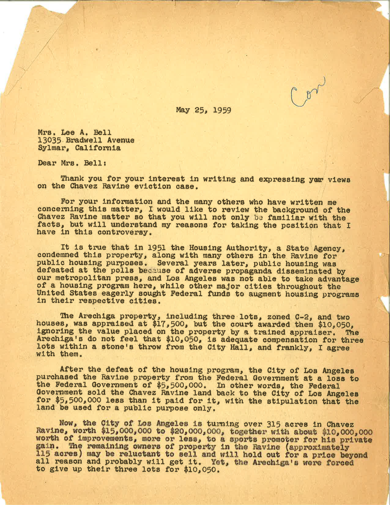
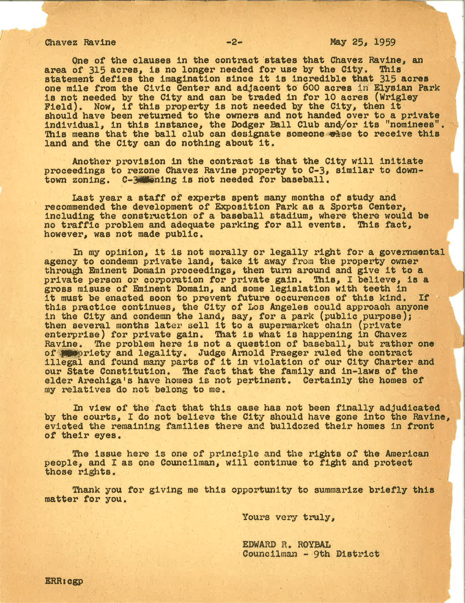

The author of the letter, Edward Ross Roybal, acted as a standing member of the Los Angeles City Council for thirteen years and of the U.S. House of Representatives for thirty years. Considered a pioneer for Latino rights in his community and the nation at large, Roybal held deep opposition to the building of the Los Angeles Dodgers ballpark in the area known as the Chavez Ravine. This land was initially intended to be used for the social benefit of the greater public. Urged by the Federal Housing Act of 1949-which granted federal money for cities to build public housing- the Los Angeles Mayor Fletcher Bowron and other elected officials originally voted to build thousands of affordable housing units in the Chavez Ravine. Through the power of eminent domain, which states the legality of taking away private property for public good with compensation, the city of Los Angeles destroyed this community during 1952 and 1953 with the promise of building inexpensive housing for the poor Mexican American families who resided in the area. Many of the families relocated voluntarily, cooperating with the city in its attempts to buy their homes. Those who moved willingly were assured that they would be rewarded with the first selection of the public housing project’s newly constructed homes; however, those who did not see promise in the new housing units refused to move and were later forcibly evicted from their homes without any form of compensation. 

With its lack of completion, the vast efforts of the public housing act ultimately deemed empty and purposeless. In 1953, the election of Mayor Norris Poulson resulted in the new administration’s consensus to put an end to the building of the public houses. Therefore, the city of Los Angeles “negotiated a deal with the federal government to abandon the public housing project with the stipulation that the nearly vacant land be used for a ‘public purpose.’”

Meanwhile, the Dodgers grew frustrated with their inability to have a new stadium built in their current home of Brooklyn, New York. With the open land resultant of the failure of the public housing act, the Dodgers and the city of Los Angeles struck a deal that seemed mutually beneficial. The team would purchase the minor-league Los Angeles Angels and transfer the 9-acre site of the Angels' ballpark, Wrigley Field, to the city. In exchange, the team would receive 315 acres in the Chavez Ravine to build a modern baseball stadium; however, the decision to sell this land for these purposes was by no means unanimously consented, as it received moral and legal contestation. Its use as the foundation of a sports stadium, which is considered a private enterprise, violated the original provision of the unoccupied land being utilized for the public and was righteously challenged in court. Councilman Roybal greatly participated in the facilitation of extensive protests and firm resistance.

Despite the citizen’s intense disapproval and participation in an extensive political battle in the summer of 1958, the Supreme Court’s verdict proved the legality of building the Dodger Stadium over the once privately owned houses in the Chavez Ravine.

The plan to build the Dodgers Stadium was executed the following year in May of 1959.  On May 9, 1959, the few remaining families were evicted and forcibly removed by sheriff deputies and bulldozers, a horrific event later to be known as “Black Friday.” The construction of the stadium on the once inhabited land soon underwent, followed by its completion and opening for the 1962 baseball season. The stadium holds “56,000 people, each with an unobstructed view of the playing field” and cost a staggering $15,500,000. To this day, the highly controversial Dodgers stadium stands over the graves of those who lived in the Chavez Ravine, symbolizing the failed efforts of Councilman Edward Roybal.

**Bibliography**

Hendersen, Gary S. 1980. &quot;Los Angeles and the Dodger War, 1957-1962&quot;. Southern California Quarterly. 62 (3): 261-289.

McCue, Andy. 2012. &quot;Barrio, Bulldozers, and Baseball: The Destruction of Chavez Ravine&quot;. NINE: A Journal of Baseball History and Culture. 21 (1): 47-52.

Parlow, M. J. 2006. &quot;Unintended Consequences: Eminent Domain and Affordable Housing&quot;. Santa Clara Law Review. 46 (4): 841-866.

Letter from Edward Roybal to Mrs. Lee A. Bell, Edward R. Roybal Papers, 107, UCLA Chicano Studies Research Center, University of California, Los Angeles.

<figcaption>
Page 1 of letter from Edward Roybal to Lee A. Bell

<small>Edward R. Roybal, 1959. Image courtesy of UCLA Library Special Collections.</small>

<figcaption>
Page 2 of letter from Edward Roybal to Lee A. Bell

<small>Edward R. Roybal, 1959. Image courtesy of UCLA Library Special Collections.</small>

