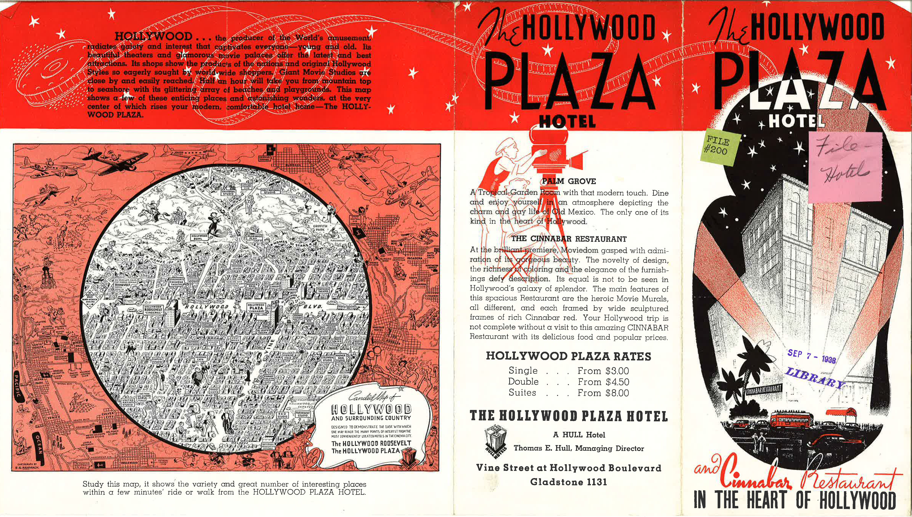
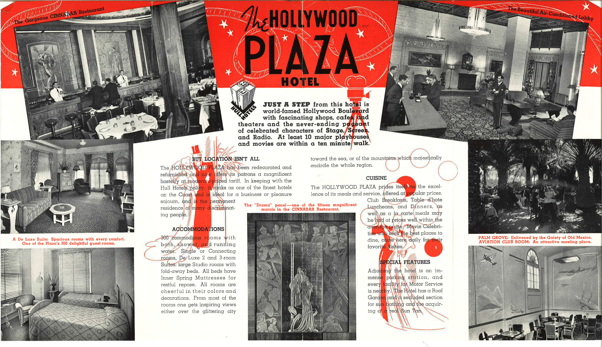

The Hollywood Plaza Hotel was once one of Hollywood’s glamorous establishments, “once” because, it no longer exists. This is not to say that all traces of the hotel have gone. A pamphlet remains. This pamphlet contains factual information expressed through advertising methods as well as an introduction to the attractive features of the hotel.

As a medium of advertisement, the pamphlet presents the pricing of the Hollywood Plaza Hotel in the 1930s. For one night, it cost three dollars for a single room, four and a half dollars for a double room and eight dollars for a suite. According to STR Global, a hotel research firm in Nashville, the average hotel rates for a single room in Los Angeles were 119.12 dollars per night at the end of 2012 (Martin). By these statistics, hotel rates increased roughly forty times over the past eighty years, which correctly reflects the increased value of U.S. currency (Williamson). The pamphlet also reveals an insight into hotel marketing in the 1930s. The pamphlet provides all the necessary information to attract customers—its location, its contact information, pictures of the rooms and other parts of the hotel, and a brief summary of the attractive features in and around the hotel. The pamphlet contains all characteristics of effective advertising. It is simple, concise and engaging; however, compared to mass media hotel advertisement today, the pamphlet is not interactive. By the mid-2000s, interactive media through the Internet had dominated and replaced static advertisement, such as newspaper listings, flyers and pamphlets (Spurgeon 12). Instead of pictures, hotels can now show a video tour of its rooms; without the limitation of fitting all contents on two sides of a paper, hotels can now list all relevant information in details. This pamphlet of the Hollywood Plaza Hotel gives a glimpse of an advertising medium that has long been replaced.

When looking at the attractive features of the Hollywood Plaza Hotel, the pamphlet glorifies not only the hotel itself, but ALSO its Cinnabar Restaurant. During the hotel’s existence on Vine Street, it saw the opening and closing of many different restaurants and nightclubs. One popular site known to bring visitors to the hotel was the Cinnabar Restaurant. This restaurant may have only been part of the hotel for less than a year, but it was a hot spot for celebrities and tourists alike.

The Cinnabar Restaurant opened following the closure of the hotel’s Russian Eagle Café in 1935. Hotel Manager Thomas E. Hull saw to it that $125,000 went into the creation of the Cinnabar (Wallach). A gala opening was held on the 17th of December 1936 for the restaurant. Several film stars attended the event, in fact, celebrities were often seen at the Cinnabar on the occasional ordinary day as well. Between the cuisine and the design of the restaurant, the most alluring feature of the Cinnabar appeared to be the well-known artistic murals that hung over the bar depicting film history (Wanamaker). As previously stated, the Cinnabar Restaurant’s time at the Hollywood Plaza Hotel was short-lived. On September of 1937, nine months after the Cinnabar made its grand opening, the restaurant found itself remodeled into Actress Clara Bow’s It Café. Named after Bow’s popular film, “It,” the nightclub was one of the first Hollywood restaurants to be associated with a big film star. The It Café saw just as many celebrities as the Cinnabar. Bow herself devoted much of her time at the It Café as manager before leaving due to her pregnancy. Not long after, Bow’s nightclub closed in 1944. This left the Hollywood Plaza Hotel with a dining room that no longer saw frequent celebrities, a change that brought the hotel closer to hotels of modern day.

Although the exterior of the Plaza Hotel provided little glamour, the interior was decorated extravagantly by George G. Benedict, a fashionable designer in the 1930s. Benedict aimed to incorporate the “charm of Latin artistry” into the appearance of the hotel. Guests entered through a classic stone entrance into a double-height lobby with a carved and painted ceiling from which wrought iron chandeliers hung. Red and gold silk damask draperies covered the lobby windows, and plush handwoven carpets spread across the grand marble floors. Guests were encouraged to spend their meals within either of the two enclosed plazas from which the hotel derived its name. The Patio de Los Palmas, a grove of date palms and rare specimen plants, lured guests in with its large stone fountain and serene atmosphere. Additional rooms located on the lobby level, such as the barber shop, beauty parlor, cigar counter, and restaurant also represented Benedict’s vision of charm and elegance. The hotel provided rooms that were segregated by gender. The smoking room, influenced by Spanish design, served as a masculine environment for conversation and cigars. Alternatively, women were offered the Ladies’ Reception Room, located on the mezzanine level. For this space, Benedict chose a “french and dainty” theme which many claimed resembled the famous boudoir of Marie Antoinette although it did not bear much similarity. In total, there were 198 guestrooms and suites in the upper levels of the Plaza Hotel, each decorated by Benedict in variations of three different color schemes: Biltmore green, Biltmore blue, and French grey. Each room accommodated guests by providing a tiled bath and dressing room, writing desks, Morris chairs, settees, and custom magazine stands. Sixty percent of the guestrooms also offered hideaway beds in order to create a more spacious and livable sitting area during the day (Vaught).

The Plaza Hotel had incredibly detailed architecture that caught the eye of many customers, but besides its internal and external beauty, the hotel had other factors that contributed to its appeal. The Plaza Hotel along with other hotels in Hollywood may have had an increase in appeal in California because Hollywood was one of the few cities that welcomed a diversity of people. The LGBTQ community felt welcomed by Hollywood along with other cities like Florida and New York (Holcomb and Luongo 711). During the 20th century, Hollywood was a place that marketed to this community hospitality and endless entertainment. Besides the wide acceptance in the popular city of diverse cultures and people, the hotels in Hollywood grew great appeal and legacy since many films in the area were being created. Because of artistic performances in the area, Hollywood developed a culture in itself that made it difficult to judge someone on its streets (Scott 3). Hollywood’s artistic and diverse history became a place of great interest to people; therefore, creating a high interest in hotels such as The Plaza Hotel for people to fully capture the city’s essence.

**Bibliography**

Gelakoska, Veronica. Pig N’ Whistle. Arcadia Publishing, 2010. 3 March 2014.

Holcomb, Briavel and Luongo, Michael. “Gay Tourism in the United States”. July 1996. Elsevier Ltd. March 9, 2014. 

ederal Writers' Project of California records (Collection 306). Library Special Collections, Charles E. Young Research Library, UCLA.

Martin, Hugo. “Hotel Room Price Rise 4.3% in 2011.” Los Angeles Times. Los Angeles Times, 07 Jan. 2012.

Scott, Alan John. “On Hollywood: The Place, the industry”. 2005. Princeton University Press. March 9, 2014.

Spurgeon, Christina. Advertising and New Media. New York, NY: Routledge, 2008

Wallach, Ruth, et al. Historic Hotels of Los Angeles and Hollywood. Arcadia Publishing, 2008. 3 March 2014.

Wanamaker, Marc, and Robert Nudelman. Early Hollywood. Arcadia Publishing, 2007. March 2014.

Williams, Gregory Paul. The Story of Hollywood: An Illustrated History. BL Press, 2011. March 2014.

Williamson, Samuel H. &quot;Seven Ways to Compute the Relative Value of a U.S. Dollar Amount, 1774 to present,&quot; Measuring Worth, 2014.

Vaught, Steve. &quot;The Hollywood Plaza – Hollywood’s Forgotten Luxury Hotel &#124; Paradise Leased.&quot; Paradise Leased..p., 24 Oct. 2012. Mar. 2014.

<figcaption>
Hollywood Plaza Hotel Brochure

<small>Federal Writers' Project of California, 1930-1942. Image courtesy of [UCLA Library Special Collections].</small>

<figcaption>
Hollywood Plaza Hotel Brochure

<small>Federal Writers' Project of California, 1930-1942. Image courtesy of [UCLA Library Special Collections].</small>

