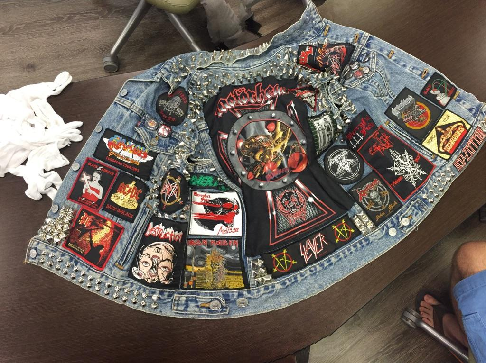

When it comes to musical culture, Los Angeles is a place where one can experience it all. Strolling down Venice Beach one might encounter a punk band screaming and embodying teenage angst, a cowboy who knows what it means to be country, or even the cliché guitarist on wheels cruising down a bike path. In musically dense Los Angeles, heavy metal has always had a place among it all. Fast, loud, and aggressive, this unique genre helped redefine music and create a lasting culture among hardcore fans.

One of the most common articles associated with the music genre was the attire worn by concert attendees. Heavy metal fans and performers commonly wore thick jackets known as “war vests.”  They were denim or leather, and heavily studded with metal spikes and patches showing off various bands. These jackets took inspiration from biker type music, and drew upon the style’s musical elements of rebellion, personal expression, and loss of innocence.  These vests were most popular during the 1980s and the 1990s, a time considered to be the heyday of heavy metal history.

Many people would wear a mix of their favorite bands on the jackets, paying tribute to the music scene as a whole as opposed to individual appreciation. Multiple groups can appear on any given jacket. The item from Special Collections displays patches from the following groups: Mötorhead, Slayer, Black Sabbath, AC DC, Saxon, Destruction, Iron Maiden, Led-Zeppelin, Scorpions, Mercyful Fate, Michael Schenker Group, Overkill, Judas Priest, Diamond Head, and many more. These bands played a huge part in influencing metal as well as other types of music we listen to today. Many of the bands who became popular in the 1980s and 1990s are still together today and quite a few even still tour. 

The popular form of dress was directly influenced by Heavy Metal’s musical sensibilities. The brutality of heavily distorted guitars intermingling with harmonies rooted in blues created a completely new form of music. It was loud and in your face, and the performers were highly emotive. Through the practice of Metal, pop-culture adapted an entirely redefined sense of the “macho man.” Armored in their war-vests, the bands resembled warriors heading to battle. As a result of Metal’s ability to attract such a strong sub-culture, it is has sustained the fluid tempers of the years and is still praised and practiced to this date in many places around Los Angeles.

Metal is a special genre in the sense that it has one of the most dedicated fanbases around. Although there are young Metal fans, many still follow the music as they have been doing since its inception. Year after year, no matter how old these musicians and fans get, you’ll find that concerts for bands like Slayer are still packed to the brim with enthusiastic metalheads. While old Heavy Metal has influenced modern music by spawning a plethora of metal subgenres, many bands stay true to the styles of old. There is an almost infinite variety when it comes to Metal music. Many of the Metal bands that became popular back in the day have gone on to become some of the most successful and well-received musical groups of all time. Even non metalheads are familiar with hit bands like AC DC, Iron Maiden, and Led-Zeppelin.

The cultural influence of Heavy Metal was significant and remains relevant today in both the major music industry and backyards of Los Angeles. Many local music and commercial establishments thrive solely off of Heavy Metal. For example, one can even find eateries like Loaded and Cinespace that pride themselves on their playlist and modeling their decor to be reminiscent of the old Metal scene. Even The Rainbow, one of the most famous rock clubs in California, often features Heavy Metal. The culture that is Heavy Metal is still thriving as much as it did during its inception period, and it isn’t going anywhere soon. People will continue to attend Heavy Metal concerts, listen to the music, and even wear war vests. 

**Bibliography**

Paraire, Philippe. 50 Years of Rock Music. Edinburgh: Chambers, 1992.

Seabury, Steve. &quot;Best Metal Bars and Eats In Los Angeles.&quot; CBS Los Angeles. 15 Dec. 2010.

<figcaption>
Heavy Metal Jacket

<small>Created in the 1980s to 1990s. Image courtesy of UCLA</small>

