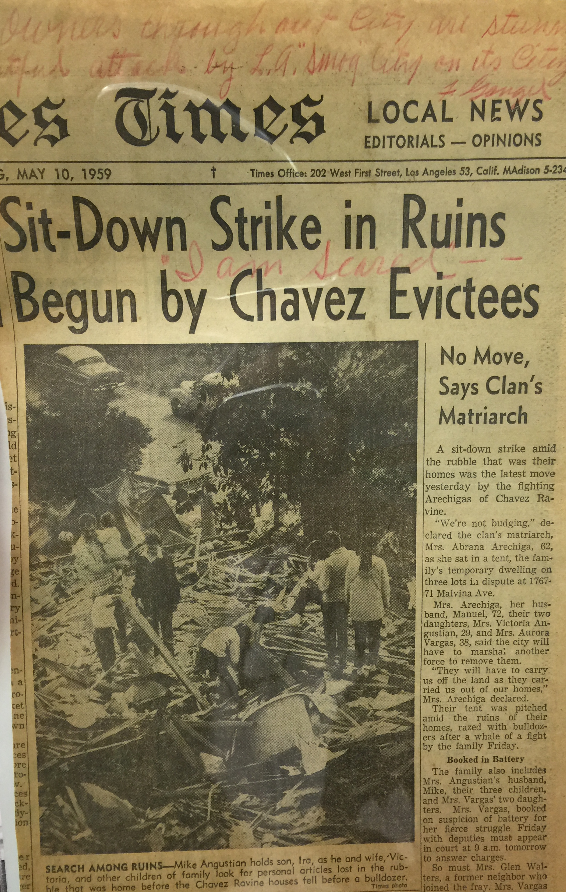
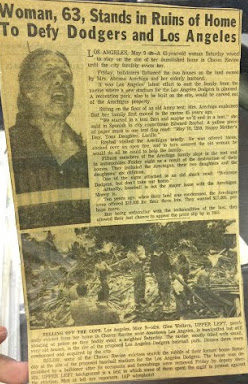

Prior to the construction of the current Dodger Stadium, the area known as Chavez Ravine was home to generations of Mexican Americans in Los Angeles. In the early 1950s, government officials forcibly evicted 300 families living in the area to make way for a low-income public housing project. By exercising the power of eminent domain, the city of Los Angeles seized property from private individuals and offered monetary compensation for construction projects for the public good (The History of Chavez Ravine). The authorized action by the city included a plan to address the post World War II housing shortage in Chavez Ravine as well as schools and playgrounds for children. After much of the land was acquired, the fear of communism began to sweep across the nation and the housing plan was accused of reflecting socialist beliefs.  In 1953 Mayor Norris Poulson was elected on an anti-socialism platform and the public housing plan was scrapped (Normark). Instead of building the promised housing, the city offered the land to the Dodgers as an enticement to come to Los Angeles. The residents of Chavez Ravine, who had been promised first pick of the apartments in the proposed housing project, were not reimbursed for their destroyed property and were forced to find housing elsewhere.

On March 10, 1959 the City’s Attorney office informed holdouts that if they did not leave by May 8, the sheriff would have to remove their belongings. Government officials forcefully evicted the people of Chavez Ravine from their personal property, yet some would not leave without a fight and they would have to literally be carried off the land. A few were determined to stay, “They didn’t want to lose their friends. They didn’t want to lose their homes” (The History of Chavez Ravine).

The Los Angeles Times article “Sit Down Strike in Ruins Begun by Chavez Evictees” presents the case of sixty-three year old Abrana Arechiga, her husband, Manuel, and their two daughters, Victoria Angustian and Aurora Vargas, who were the among the residents to resist the land acquisition in Chavez Ravine. Mrs. Arechiga declared that &quot;they will have to carry us off the land as they carried us out of our homes.&quot; Aurora Vargas was the last person to be evicted from Chavez Ravine, threatening that “they’ll have to carry me.” She was determined to fight for her right to stay, but ended up being forced out of her household by police officials. Vargas was screaming and kicking as the officials “dragged [her] by her wrists and ankles like a shackled butterfly” off the land (Skyhorse 27).

The helplessness and indignation she experienced was felt throughout the community as the city cleared the land, destroying their homes, schools, and churches. The city, driven by economic interests, completely disregarded the powerless minority group and their way of life. To the residents Chavez Ravine was more than just a piece of land. The community was tight-knit and filled with the traditions and culture of the 300 families that lived there (Goldberg). Residents here ran their own schools and churches, grew their own food, and raised livestock (Goldberg).  This community of families was thriving off their way of life, but it did not stop the city of Los Angeles’ attempt to make changes.

**Bibliography**

Goldberg, Eve. &quot;Frank Wilkinson and the Battle of Chavez Ravine.&quot; Sports in American Popular Culture Americana: The Institute for the Study of American Popular Culture, May 2010. Web. 03 Nov. 2015.

Normark, Don. Chávez Ravine: 1949: A Los Angeles Story. San Francisco: Chronicle LLC, 1999. PDF.

Skyhorse, Brando. The Madonnas of Echo Park. New York: Free, 2010. Print.

&quot;The History of Chavez Ravine.&quot; Independent Lens. PBS, n.d. Web. 03 Nov. 2015.

<figcaption>
"Sit-Down Strike in Ruins Begun by Chavez Evictees"

<small>Los Angeles Times, 10 May 1959. Image courtesy of UCLA Library Special Collections</small>

<figcaption>
"Woman, 63, Stands in Ruins of Home to Defy Dodgers and Los Angeles"

<small>Los Angeles Times, 09 May 1959. Image courtesy of UCLA Library Special Collections</small>

