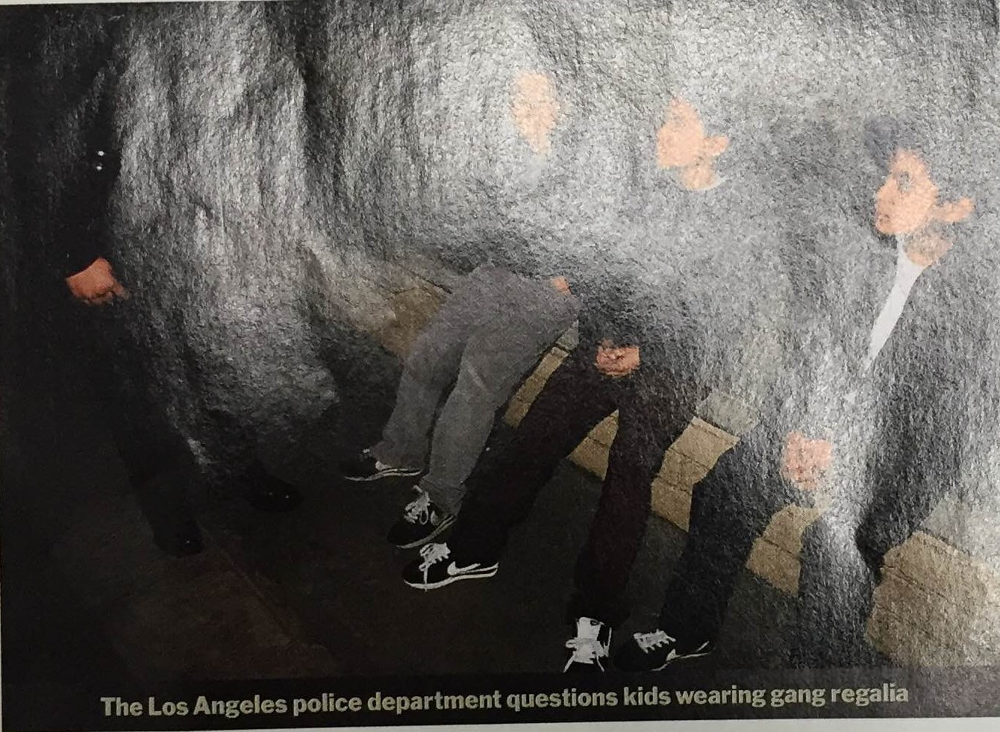
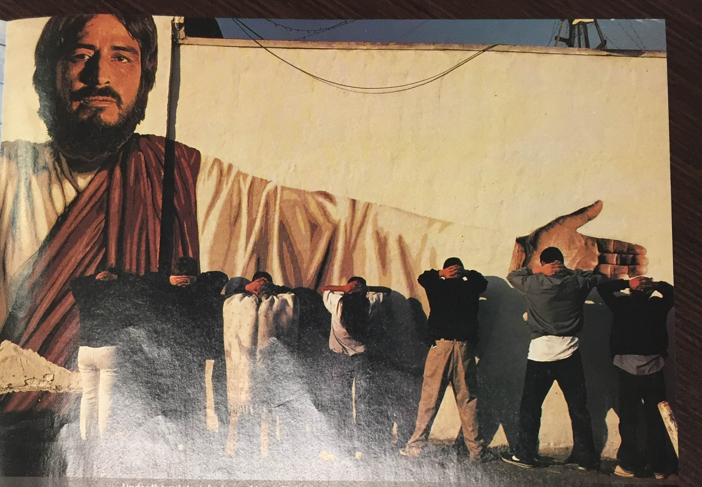
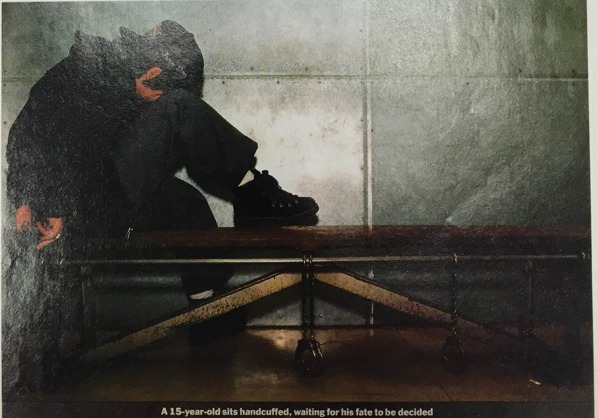

When Mark Kirksey, a member of the Grape Street Crips, was interviewed by a reporter for the street gangs website, he was asked the question “Where do you see yourself in five years?” At the time, Kirksey was thirty-six years old, but he has been involved in gang activity since the age of twelve. Kirksey responded by saying that he didn’t want to be involved in gang activity forever, but for now this is what he was doing. In simpler words, he had no idea. All he could focus on was the present. Kirksey was killed at the age of thirty-seven in Watts, California. Unfortunately, this is the reality of most gang members: their future will most likely end in a lifetime sentence in prison or buried six feet under. So what’s the appeal, specifically with young boys?

In the article in which the pictures are found, “All Ganged Up,” the author looks into the lives of two young gang members, “Lil Ducc” and Henry.  Through interviews with young gang members, the author explores the reasoning behind why children join gangs.  She interviews moms who claim they wouldn’t mind seeing their sons arrested because it would mean they wouldn’t be killed on the streets. Both “Lil Ducc” and Henry had been arrested for gang activity before they were fifteen years old. “Lil Ducc” told his story about how he went on his first drive-by when he was eleven and shot a rival gang member the next day. Henry told a similar story about how he went on a “mission” to get revenge for a member of his gang who had been shot. On the mission he shot three times at a rival gang and hit one member. Because it was the life they chose, neither Little Ducc nor Henry felt remorse for their actions.

The three gangs mentioned in this article are the Grape Street Crips, Florencia 13, and Weigand Colonia Watts. Florencia 13, one of the largest Varrios in Los Angeles, originated in the 1940s, while Grape Street Crips and Colonia Watts formed around the 1970s. The branches of these Crip gangs are based off of the different streets and neighborhoods in South Central, Los Angeles. The Grape Street Crips were established on Grape Street, Los Angeles, Florencia 13 on Florence Avenue, and Weigand Colonia Watts on Weigand Avenue. The members from the different gangs are not allowed to cross territory lines because they see each other as rivals. Shoot-outs, drive-bys, and obtaining fast money through robbing and the selling of drugs are all things associated with gangs and the lives of young teens. Although children are not fully initiated into the gangs until they shoot at another human being, their lives revolve around the chaos associated with gangs.

Children join gangs for personal advantages, protection, and affection. In the Watts area, gang membership can give one popularity or respect amongst friends in one’s community or school. The adolescents in the Watts community often join gangs for the social relationships and protection from other gangs. In communities similar to Watts, it is constant subsequent gang violence, and in order to get protection one has to join a gang. Children see joining a gang as  rational, but often fail to see the negative aspect of them. They can only think about the exciting delinquent activities they will partake in. Another reason why children in this area will join a gang is because of their lives at home. The children of this area are victims of impaired parental care, which ultimately leads to the joining of gangs. Poor supervision, inappropriate use of authority, and negative emotional parent-child relationships are all factors that contribute to youth joining gangs. The lack of proper family management practices lead minority youth to join gangs as a substitute for their family. The gangs provide kids the emotional support that isn’t available at home.

The three pictures found within the Time Magazine article aren’t directly related to Little Ducc, Henry, or specifically any of the mentioned gangs, but their stories give valuable context for the people in these pictures. The first picture depicts three young latino boys being questioned by a police officer. The second is of seven latino teenagers in front a mural of Jesus, about to be questioned by police. The third is of a worried looking boy in a waiting cell. Under the first picture is a caption that reads “The Los Angeles police department questions kids wearing gang regalia.” Regardless of age, the police question anyone who wears clothes that resemble gang culture. Rather than be at home late at night, these boys are out putting in “work” for their gang. The second picture has a caption under it that says “Under the outstretched arm of Jesus Christ, teenagers line up to be searched for weapons and drugs.” The common style that young latino gang members adopt are large white t-shirts, baggy pants, Nike Cortez’s and Chuck Taylors, and colored bandanas that represent their respective gang. The mural is painted on a building near 111th street and and Vermont Avenue in Los Angeles. It was “commissioned” by South Los (Solos) gang who assisted in painting it. It's ironic that a gang whose goals are to disrupt the streets of South Central by killing, stealing, and dealing drugs would want to depict Jesus, who traditionally represents peace and love. As Jesus spreads his arm across to show the young adults lined up, we ask ourselves: What has the world come to? The last picture appeals to the reader’s emotion because it portrays a melancholic young boy in handcuffs. Head on his knees, the child awaits his fate, which could be imprisonment. It’s unfortunate to know that a kid who did not have control over the cards he was dealt would be susceptible to the stereotype . It exemplifies the cycle children living in Watts, Los Angeles must experience on a regular basis.

**Bibliography**

&quot;Grape Street Watts Crips – South Los Angeles &#124; Jordan Downs &#124; Baby Locos.&quot; Grape Street Watts Crips – South Los Angeles. N.p., n.d. Web. 23 Nov. 2015.

Stanley, Alessandra. &quot;Los Angeles All Ganged Up,&quot; Time. Time Inc., 18 June 1990. 

<figcaption>
Three Young Gangmembers

<small>Image courtesy of UCLA library special collections</small>

<figcaption>
Jesus and 7 Young Gangmembers

<small>UCLA libarary special collections</small>

<figcaption>
Young Teen Locked Up

<small>Creator, date. Image courtesy of ...</small>

