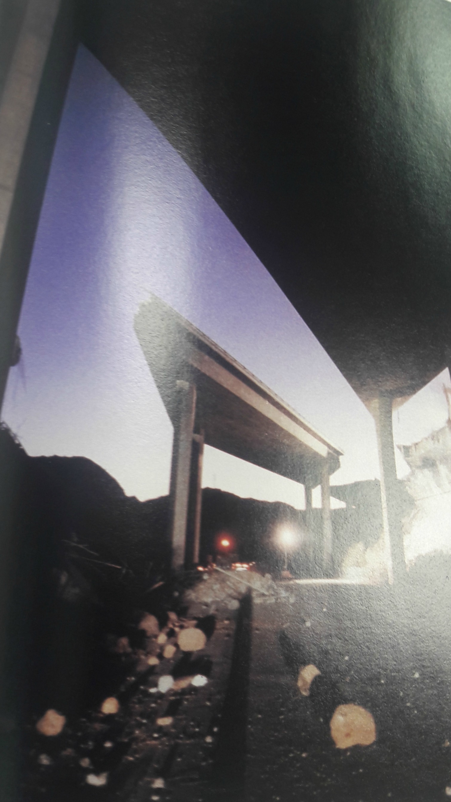
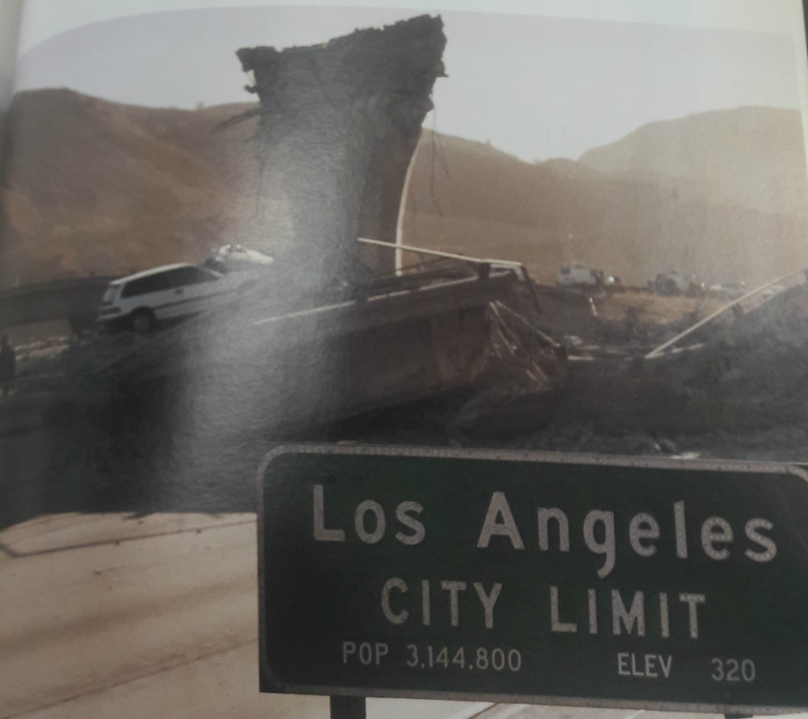

The 1994 Northridge Earthquake was one of the most damaging disasters in US history, costing over twenty-five billion dollars. It struck at 4:31 a.m. on January 17, 1994, lasting 10-20 seconds not including the aftershocks. With a magnitude of 6.7, it was felt as far as Las Vegas, and hospitalized 11,846 people (Bolin). The structures and population of Northridge were completely vulnerable. In a state of confusion, people fled collapsing buildings and highways as their surroundings went up in flames (Bolin). Because Northridge is very urbanized and extremely populated, the main source of transportation are freeways which were severely damaged. The Northridge earthquake left residents agitated and uneasy. The chaos of this natural disaster unnerved and unseated many people, with great social impact.

Fifty seven people were killed, fourteen of whom were crushed while 9,000 more were injured when Highway 14 collapsed. While the San Fernando Valley had the most damage, the collapse of the Santa Monica/I-10 freeway, the “transportation artery” (Bolin) of Los Angeles, had a devastating impact.The collapse forced traffic into crowded surface streets between Santa Monica and Downtown LA. The freeway was such a crucial part of every Los Angeles residents’ commute for the past 23 years that its destruction led to a standstill in many residents’ daily routines.

The freeway was rebuilt within only 84 days after the earthquake, which was an enormous achievement for people involved in its reconstruction. It was completed approximately two and a half months before the expected completion date, and cost the government an extra $14.6 million dollars (Mitchell). The workers worked long shifts--seven days a week to make this possible. Their incentive was a weekly pay of $2,000 and the contractors were paid an extra $200,000 for each day cut from the expected completion date (Reckard). This shows just how crucial the freeway was for the local residents as the government was willing to pay such an astronomical fee for its early completion. Without this portion of the freeway it seems as if the heart of the city was skipping a beat. Millions of dollars were lost in fixing the freeway and in traffic delays, which left a negative impact on the economy. It further impacted firms as they were faced with additional losses due to transportation damage. Downtown Los Angeles and West Los Angeles, which consist of cities such as Beverly Hills and Santa Monica, are connected by the I-10; as such, the corridor consists of the largest number of jobs in the city (Giuliano). Therefore, it is evident that the freeway’s destruction had adverse impacts on businesses. An approximate 39% of business losses were due to damage to the transportation systems (Boarnet). People tried to find alternate routes, but these caused delays of 20 minutes or more. (Nora Zamichow and Virginia Ellis).  As a result, employees took longer to get to work, and many had to alter their work hours in order to avoid traffic, which negatively impacted the productivity of firms.

There are more than 575,000 bridges in the United States, of which about 60% were constructed before 1970 with little regard given to seismic stability (Cooper). Of the many elements in a highway system, bridges appear to be the most vulnerable to failure during an earthquake. The engineers that designed the Santa Monica Freeway overpass were not surprised by its failures resulting from the 1994 Northridge Earthquake. They were well aware of its lack of structural integrity among certain areas. Namely, it was expected that the parts of the overpass that were supported by shorter columns would be less sturdy than areas supported by long columns in the event of a major disaster. This is because during an earthquake, the longer columns are more flexible and can sway horizontally to absorb and mitigate most of the impact. The less-flexible short columns cannot flex to absorb the energy caused by the sway of the longer columns, resulting in breakage. This effect was mostly observed in older bridges where the disparity in length between columns was relatively large, allowing the horizontal forces to multiply in magnitude and destroy the bridges.

After such a devastating and expensive earthquake, Los Angeles knew changes would have to be made. The construction and architecture of the highways and overpasses had failed in many ways. What could be done to fix the failures and prevent a collapse of this magnitude from happening again? The first step to fix the tense situation was to come up with a temporary solution. Temporary structures were built near the Santa Monica and Simi Valley freeways to allow traffic to flow while the new bridges were being constructed. The next solution would be to come up with a long term fix, which started with the bases of the bridges. Construction workers first drilled rods 65 feet into the ground to provide more stability (Caltrans). The support bars were also drastically improved. Before 1971, steel support bars had no side-to-side supports, however after the earthquake, steel rods were wrapped around vertical steel to enforce strength in columns (Caltrans). A key addition was to add hinges to bridges, which would allow for slight swaying and not cause the bridges to crack (Caltrans). Even though the renovation of bridges costed millions of dollars, it was well worth it. The public could now feel safer and more at ease when traveling on freeways.

There is much to be taken from the 1994 Northridge Earthquake. It is easy to dwell on the negative effects of a huge disaster, but it is necessary to be able to learn from failure. The collapse of the Santa Monica Freeway meant devastation, disturbance, and destruction. Lives were lost, businesses suffered, and livelihood was disrupted. Southern California’s “transportation artery” was severed; the temporary patch was essential in getting lives running again. In the long term, improved design and careful consideration will ultimately stitch the city back together.

**Bibliography**

Boarnet, Marlon G. &quot;Business losses, transportation damage and the Northridge earthquake.&quot; University of California Transportation Center (1996).

Bolin, Robert C., and Lois Stanford. The Northridge Earthquake: Vulnerability and Disaster. London: Routledge, 1998. Print.

Giuliano, Genevieve, and Jacqueline Golob. &quot;Impacts of the Northridge earthquake on transit and highway use.&quot; Journal of Transportation and Statistics 1.2 (1998): 1-20.

Mitchell, Denis, et al. &quot;Performance of bridges in the 1994 Northridge earthquake.&quot; Canadian Journal of Civil Engineering 22.2 (1995): 415-427.

Nora Zamichow and Virginia Ellis, Times Staff Writers, “Santa Monica Freeway to Reopen on Tuesday : Recovery: The contractor will get a $14.5-million bonus for finishing earthquake repairs 74 days early.” California Department of Transportation, April 6, 1994

Reckard, E. S. &quot;Many I-10 Workers Routinely Earn $2,000 Weekly Take Home Pay.&quot; Los Angeles Sentinel (1934-2005): 1. Apr 07 1994. ProQuest.

The Staff of the Los Angeles Times, comp. 4:31: Images of the 1994 Los Angeles Earthquake. Los Angeles, CA: Times, 1994. Print.

<figcaption>
Collapsed Highway

<small>Photograph by Jayne Kamin-Oncea from 4:31: Images of the Los Angeles Earthquake, LA Times, 1994</small>

<figcaption>
Earthquake Ruins

<small>Photograph by unknown photographer from 4:31: Images of the Los Angeles Earthquake, LA Times, 1994</small>

