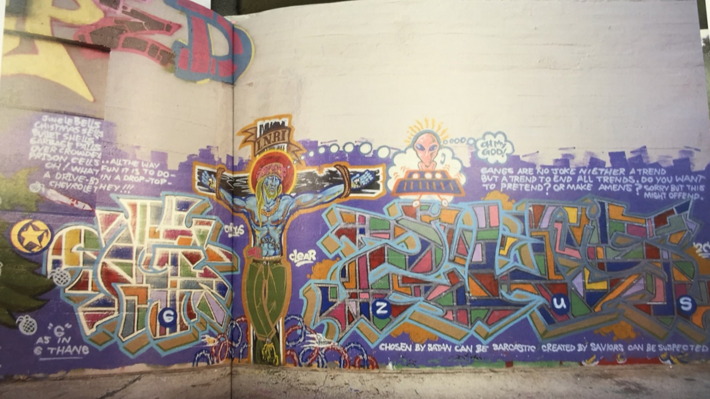

The city of Los Angeles plays a significant role in the development of graffiti writing and its canonization as art. In Steve Grody’s book, Graffiti L.A.: Street Styles and Art, the history, techniques, and social elements of graffiti are analyzed through passages and images of numerous artworks. Grody touches on the origins of graffiti, which was brought from Philadelphia, to New York, and finally to Los Angeles. The book highlights graffiti for its freedom of expression and communication within cities choked with media and advertisements. Because of this impermanence and detachment from commercial values, it is one of the most raw forms of art seen in modern society. A particular form of graffiti is the mural, which is distinguished from other methods such as tagging names because of its narrative features regarding a gang’s history. Grody presents the art form’s collaborative elements through the example of the gangs Circus and Clear, located in Melrose Avenue.

Los Angeles’s diversity has allowed various graffiti styles to emerge in different locations of neighborhoods across the city. Depending on the relative location, crews, and demographics, each neighborhood has its own sense of art style. Melrose Avenue is one of the areas that has remarkably fostered the spread of graffiti. With various skate shops, street wear stores, tattoo parlors, and charming cafes around, the location is known for its artistic scene. The evolution of graffiti begins with the marking of territories, or “tagging” one’s name and gang onto the neighborhood walls. Initially using alleyways as platforms to tag names during the earliest years of graffiti, young people eventually got commissioned for store fronts as their styles flourished with time. Some of these street artists even advanced to galleries with the help of gallery owners whose eyes were caught by the artwork while driving down the streets of Melrose; however, gang members dominate graffiti art as they use the streets to express themselves.

L.A. gangs use walls to mark their territories and manifest their ideas to the public. For example, Circus and Clear are able to express their religious concepts through their graffiti. The painting consists of Jesus dressed in hip-hop and gang styled clothing and accessories. He wears a gold chain around his neck, low pants that expose his underpants, and a gun with the barrel facing down secured by his pants. One possible explanation for this wardrobe choice can be traced back to Christianity. Jesus is believed to be the savior of mankind and many gangs believe themselves the protectors and saviors of their communities; therefore, they may see it correct to dress Jesus like themselves. On the other hand, Circus and Clear could have use the clothing to challenge religion. Gangs are associated with crimes and disagreeable behavior as Jesus is associated with loving and perfect behavior. The gangs may have wanted to make a claim that Jesus was not the type of person many people believe he was. Along with the chosen wardrobe, the graffiti’s colors, designs, and quotes can also capture one’s attention.

Purple, a color that often symbolizes power, remains as the painting’s main background color. According to the Bible, the Roman soldiers dressed Jesus in purple clothing for his crucifixion; an act that can be interpreted to ridicule His royalty. Also as a part of Jesus’s thought bubble, there is an extraterrestrial drawing of an alien that says “Oh My God,” in which further fuels the ongoing debate between religion and science. The symmetric blocks of letters are written in many colors and contribute a chaotic feeling to the art. In addition to the criticism of religion, there are also three quotes depicting gang life in the graffiti.

The quotes within the Circus and Clear graffiti represent the rebellious and tough mentality of the gangs. In the upper left corner, the gangs talk about the bullets and overcrowded prison cells through the famous “Jingle Bells” melody. Also, the quote in the upper right corner validates gang life when it states that “gangs are no joke neither a trend but a trend to end trends.” Lastly, the reference to Satan and the saviors in the bottom right corner can be seen as a metaphor between the police and the gangs themselves. The quote “chosen by Satan can be sarcastic created by the saviors can be suspected,” challenges the belief of goodness in law enforcement and the assumption of evilness in gangs. The Circus and Clear graffiti exemplifies how one can use graffiti art as a form of expression.

The exact reasons why this graffiti portrays a gang-styled Jesus is unknown as well as why particular features like colors and quotes are used, but maybe that is another purpose of graffiti: to leave the perceptions up to the imagination. Many other graffiti artists and gangs use art to express their religious viewpoint. They incorporate religious symbols and quotes as well as other fundamental graffiti art traits such as vibrant colors and block letters. Melrose Avenue cultivated this wave of art in Los Angeles, becoming the home of many of these eccentric artworks and a voice for many people. Graffiti L.A.: Street Styles and Art succeeds in both showcasing the graffiti in the city of Los Angeles and describing the histories behind them.

**Bibliography**

Stein, Andrew. &quot;An Introduction to Gang Graffiti.&quot; Examiner. AXS Network, 16 July, 2013. Web.

<figcaption>
Graffiti L.A.

<small>Hash Crew, 2006. Image courtesy of UCLA Library Special Collections.</small>

<figcaption>
Circus and Clear

<small>Circus and Clear, 1994. Image courtesy of UCLA Library Special Collections.</small>

