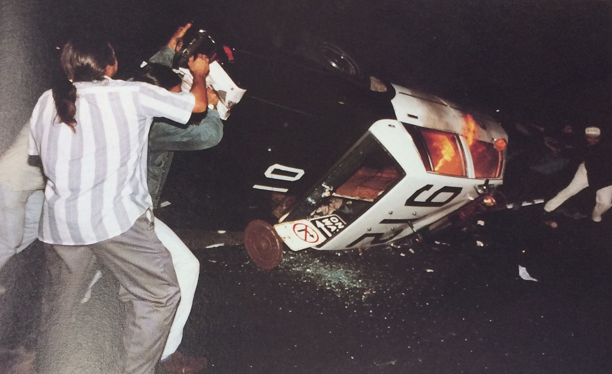

Revolution Towards Change

Known as one of the largest riots to occur in the nation’s history, the LA riots-- also known as the Rodney King riots-- caused more damage and deaths than anyone could have possibly imagined. The riots lasted a total of six days, focusing national media on the unjust police brutality inflicted upon Rodney King.

Rodney King, an African American man, was involved in a high speed chase and was presumed under the influence. When the cops caught up with him, they severely beat King with their batons, kicked him, and tased him several times (Martin, 43). The beating was caught on tape and shared with the press, which outraged various communities such as South Central LA and other minority-based neighborhoods (Bergensen, 40). The trial took place on April 29, 1992, where the four officers were charged for excessive force and brutality. When the verdict of innocent was announced later that afternoon, violence ensued. Many could neither believe nor understand how four cops brutally beating a man on tape were not convicted of the charges but rather acquitted. A popular belief was that the all-white jury surely influenced the verdict, and it soon became known to the public how corrupt the legal system was, even with sufficient evidence.

Rioters immediately took action, dragging a man out of his truck and beating him in the road; the violence only worsened from that point forward. The city completely lacked order; no one would listen to police department or any form of authority. People looted, committed arson and heinous crimes, assaulted other citizens, and some even committed murder. With a total of 53 deaths and over $1 billion in property damage, the riots showed how a community can come together to make for social reform regardless of what was at risk (Watts). No one seemed to care for the consequences that could follow after; they were solely focused on fighting for a change, fighting for a purpose, and they did everything in their power to do just that.

The LA riots were one of the worst recorded in history, but they managed to bring light to modern-day racism and police brutality. The violence may have been excessive, but it was necessary to prove a point to the public; injustice shall not go without consequence, and justice will always find a way to prevail whether it be in the legal system or in the hands of the people.

The media during the Los Angeles Riots has been one of the most intense in LA history. There were over 800 instances of media coverage and over 900 stories. Many more could have made the air, but some news programs were missing due to programming changes (Smith, 4). With such a variety of news and information, inevitably, facts were wrong and details were lost; however, in general, the media was biased toward whites. Violent events that arose during the riots; such as shootings, vandalism, and physical violence were mostly directed towards African Americans and Latinos. Erna Smith utilized historical evidence to state that “Black Weekly focused on long-standing black grievances with Korean store owners, the police, and the criminal justice system, while coverage in the Korean Weekly focused on Korean store owners’ long standing problems with gangs, crime and anti-Asian bias” (Smith, 3). Many negative stereotypical comments were made about African Americans, and not much was said about whites in news articles even though they were also involved in the riots. There were plenty of sources where the news media obtained their information, some were even eyewitnesses, but it was difficult to differentiate which sources were reliable.

Social media was not as advanced in the twentieth century as it is now; therefore, news broadcasts were the major source of information. It is possible that use of social media might have engaged a greater number of people and promoted peace in Central and South Central Los Angeles, as well as equality when it came to police brutality. Far more people could have been informed, which would result in more citizens taking initiative to stand for a change.

The image presented on the website demonstrates one side of the LA Riots. Although the common image of the riots is as a violent event, the riots represented more; they were a statement about injustice in Los Angeles, and ultimately, society as a whole. The image alone does not do justice to the entirety of the movement, rather it depicts the LA Riots in a negative manner (Understanding the Riots, 50). Although many of the events involved some form of chaos, activists saw that as the only way to bring attention to their cause.

Depicted in the image are a group of individuals flipping a police car that has already been set on fire. This alone is enough to convince many that the riots are an excuse for delinquents to stage violent acts without reprimand. Nevertheless, the initial motive for these radical activists is the thirst for justice. Simple protests and speeches in front of populated areas did little to help bring awareness to the police brutality situation that happened against Rodney King and other minorities in the past. Consequently, looters believed they had to go to the extreme to make their voice heard.

In essence, the LA Riots impacted a massive amount of people, whether they identified as a minority or not. One image does not do justice to the way the riots changed people’s lives; someone can deduce that the riots were unnecessary violence whereas another individual can claim that the picture shows the power of the people and how it cannot be silenced when everyone works toward the same goal.

**Bibliography**

Bergesen, Albert, and Max Herman. “Immigration, Race, and Riot: The 1992 Los Angeles 		Uprising”. American Sociological Review 63.1 (1998): 39–54.

Martin, Brian. “Justice Ignited: The Dynamics of Backfire” (Lanham, MD: Rowman and			 Littlefield, 2007), pp. 43-64

Ebright, Olsen. &quot;Live Tweeting the Los Angeles Riots in Real Time&quot;. N.p., n.d.

Watts, Paul. “Revisiting the 1992 Los Angeles Riots: An Analysis of  Geographical 			Perspectives”. (2003). 

Smith, Erna. &quot;Transmitting Race: The Los Angeles Riot in Television News&quot; Joan Shorenstein Barone Center on the press, politics, and public policy, John F. Kennedy School of Government, Harvard University (1994).

Understanding the Riots: Los Angeles before and after the Rodney King Case. Los Angeles, Calif.: Los Angeles Times, 1992. p. 50. Print.

<figcaption>
First Night of the Riots

<small>Alan Duignan, April 29, 1992 from Understanding the Riots.</small>

