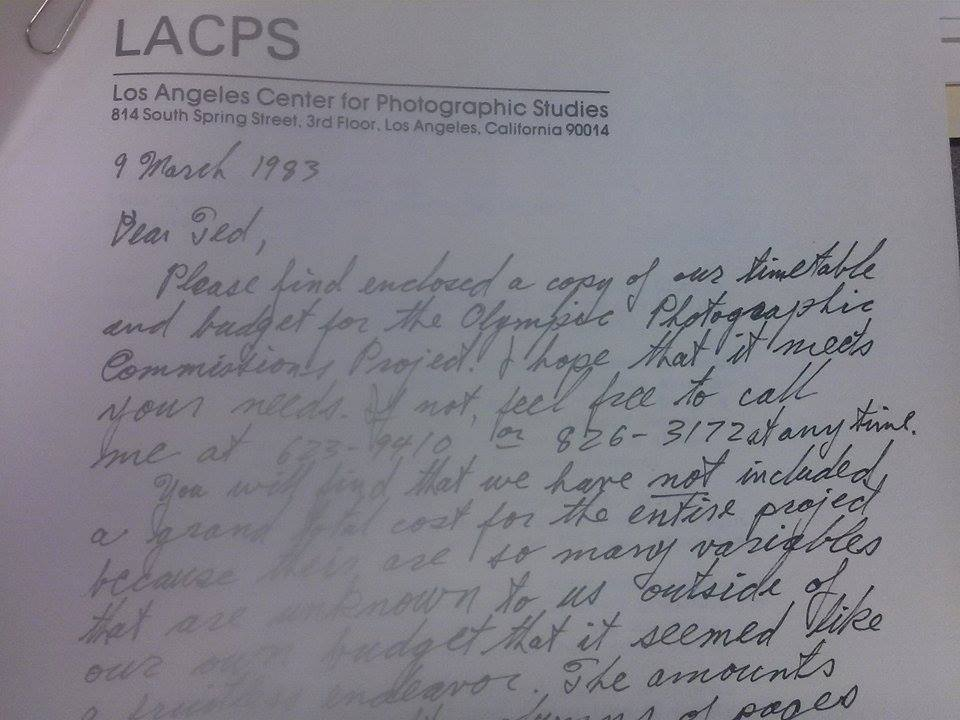
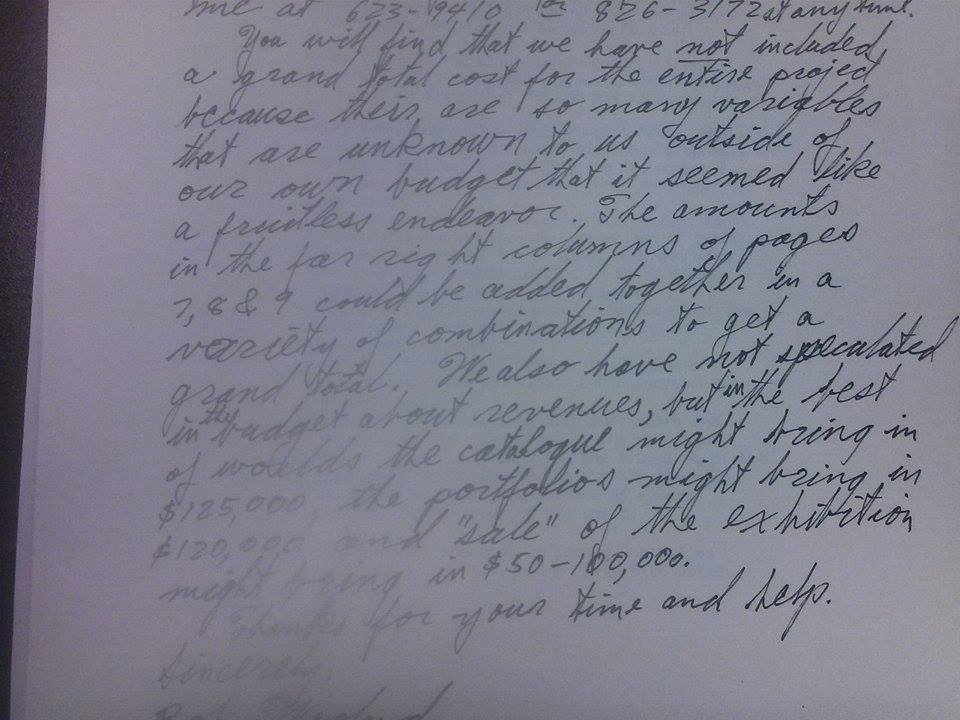

Prior to the 1984 Los Angeles Olympics, the 1932 and 1952 Olympics were the only modern Games to ever turn out profit for the host country. The 1976 Montreal Games was a financial disaster that left Montreal with a $1 billion debt. Naturally, no countries wanted to offer hosting of the Games – all but Los Angeles. The citizens of Los Angeles protested against using taxpayers’ dollars to finance the Olympics for the fear of bankrupting the city. It was decided upon by the International Olympic Committee that, for the first time ever, private corporations rather than government organizations would subsidize the Olympics. To cover the expenditures, the Games were commercialized to promote ticket sales, television revenues, and sponsorships. One way to advertise the Olympics was through the Photographic Commissions Project.

The aim of the 1984 Olympics Art Festival was to bring back the experience of Olympics. In Ancient Greece, athletes and artists came together to show the world their respective talents. In 1984, the organizers of the Los Angeles Olympics determined that it was imperative to incorporate a cultural aspect to the games. The committee decided it was best to have the performances precede the actual competition for a duration of ten weeks leading up to the Games. This festival, that had a budget of ten million dollars, emphasized variety by incorporating many different cultures and disciplines; a lot of focus was dedicated to tradition to preserve old arts and ideas. This event was directed by Robert J. Fitzpatrick and was the largest arts festival held by the United States at the time. There were over four-hundred performances that were produced by one-hundred and forty-five dance, theater, and music groups that came from every continent, and eighteen countries. Put on by people of thirteen foreign countries, the festival was mainly made up of theatre performances, as there were three hundred and twenty-seven.. The most impressive shows were also the most innovative as they swayed the audience in not only a dramatic aspect but also a theatrical one. Without this event, the Olympics would not have resembled the Games that took place in Ancient Greece as the productions themselves were of great importance to Greek culture. It was therefore essential to dedicate a substantial fraction of the Olympics that explored and displayed many cultures from all across the world.

The Los Angeles Arts Festival had two criteria for the selection of artists and performances:  excellence and diversity. In other words, all performances and exhibitions should match the honor of the Olympians and should display multicultural backgrounds. 

Based on those expectations, more than four hundred performances from eighteen countries were brought to the festival. The host countries of previous Olympiads all received invitations to send representatives to the festival. South America and Africa were invited so as to increase “the continental representation”. The People’s Republic of China was also invited to “commemorate its first appearance in an Olympiad since the Los Angeles Games of 1932.” Finally, as the host country of the 1988 Olympics Games, Korea was added to the invitation list. Many performing groups accepted the invitations, and in total the ten-week-long Los Angeles Olympic Arts Festival presented performances from 145 theatre, dance and music companies. Among all those performing arts companies, Britain's Royal Opera of Covent Garden, the National Theater of Greece, Circus Oz from Australia, and the erotic modern dance company Sankaijuku from Japan made their American debuts.

The performances as well as the visual arts displayed on the festival provided the viewers with great visual pleasures. Piccolo, Soleil, Cricot, and Waseda presented the most spectacular performances all in an innovative way, astonishing the viewers “not simply in dramatic but also in theatrical dimensions.” As for the visual arts, many countries contributed their most valuable collections. Three major operatic productions were shipped from Covent Garden. France shipped 45 Impressionist masterpieces from the Louvre Museum to Los Angeles. The Kasuga Shrine in Japan made an exception by loaning the festival ancient ceremonial masks and robes that had never been exhibited outside the shrine in Nara. Museums from many other countries and some American local museums also contributed to the exhibitions of visual arts. In the end, to leave a visible legacy to the host city Los Angeles, LAOOC commissioned several works of public art, which included the sculptures in the Memorial Coliseum in Exposition Park and the murals to adorn the freeways between Downtown Los Angeles and the Coliseum.

The popularity of sports events plays an integral role in the economic life of a city. Los Angeles played a huge entrepreneurial role for the 1984 Olympic games, as it bid and helped to raise $158,000,000 in private funds. With the help of business leaders and local corporations, “Los Angeles made it feasible for the state and federal governments to finance little to no money for the games,” according to (Andranovich, 2001). The raised money allowed the Los Angeles Olympic Organizing Committee (LAOOC) to increase revenues while having the ability to control most of the arts festival organization. The location of the games encouraged more live performers and attracted larger crowds, which brought larger profits. Furthermore, the LAOOC signed up volunteers rather than paid staff, while having the power to make decisions without political consensus. 

With the help of proposition N, which helped to raise ticket and hotel prices, LAOOC abstained from using general public funds, and hosted a remarkable “Capitalist Olympics” that turned into huge profits and influenced recent innovations in the city of Los Angeles. $100 million out of the $9.6 billion it took for Los Angeles to host the games, was used for the installation of an athletics facility -administration building- at UCLA, along with other innovations that supported youth sport foundations. All in all, the Los Angeles 1984 Olympic games hosted a remarkable arts festival as efficiently and profitably as possible, and supported by other innovative organizations across the city.

<figcaption>
Letter regarding the Olympic Photographic Commisions Project

<small>The Los Angeles Organizing Committee(LAAOC), 1978-1984. Image courtesy of UCLA Library Special Collections.</small>

<figcaption>
Letter Continued

<small>The Los Angeles Organizing Committee(LAAOC), 1978-1984. Image courtesy of UCLA Library Special Collections.</small>

<section id="categories" markdown="1">
**Bibliography**

“1984 Summer Olympics.” Wikipedia.

Andranovich, Greg, Matthew J. Burbank, and Charles H. Heying. &quot;Olympic Cities: Lessons Learned from Mega-Event Politics.&quot; Journal of Urban Affairs, 23.2 (2001): 113-31.

“Fall 2014 Performance Arts: Echoes of 1984’s Olympic Arts Festival.” Los Angeles Times, 12 September, 2014.

Fitzpatrick, Robert J. &quot;Olympic Arts Festival.&quot; Los Angeles Times Syndicate, 1984.

Harmetz, Aljean. &quot;Olympic Arts Festical Opens in L.A.&quot; The New York Times, 01 June 1984.

&quot;Olympic Art Festival.&quot; Official Report Los Angeles, 1984. Volume One, Part Two. http://www.antenna-theater.org/antest/wp-content/uploads/2013/01/1984OlympicsArtsFestival_LA.pdf

Sanders, Barry A. The Los Angeles 1984 Olympic Games. Arcadia Publishing, 2013.

Stodder, Joseph H. “Review of The Los Angeles Olympic Arts Festival.” Theatre Journal 37.1 (1985): 103–106.

</section>