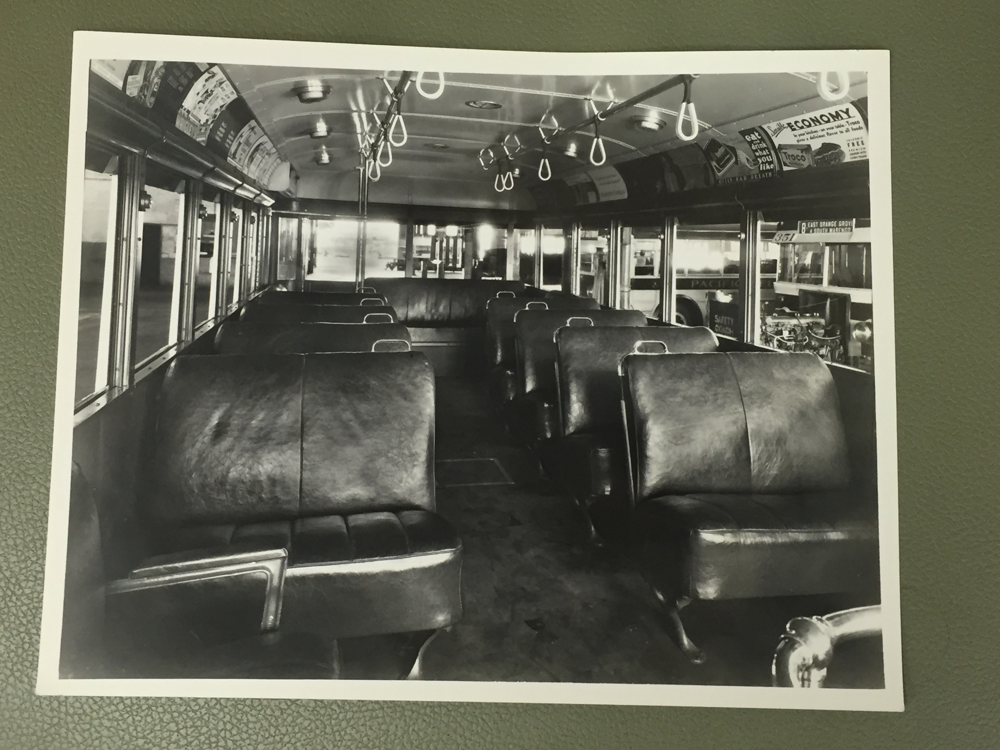
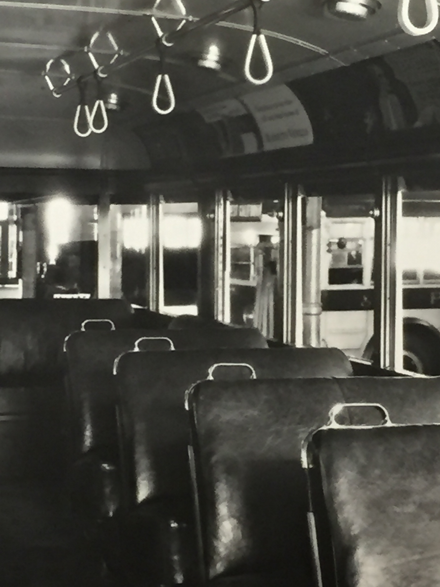
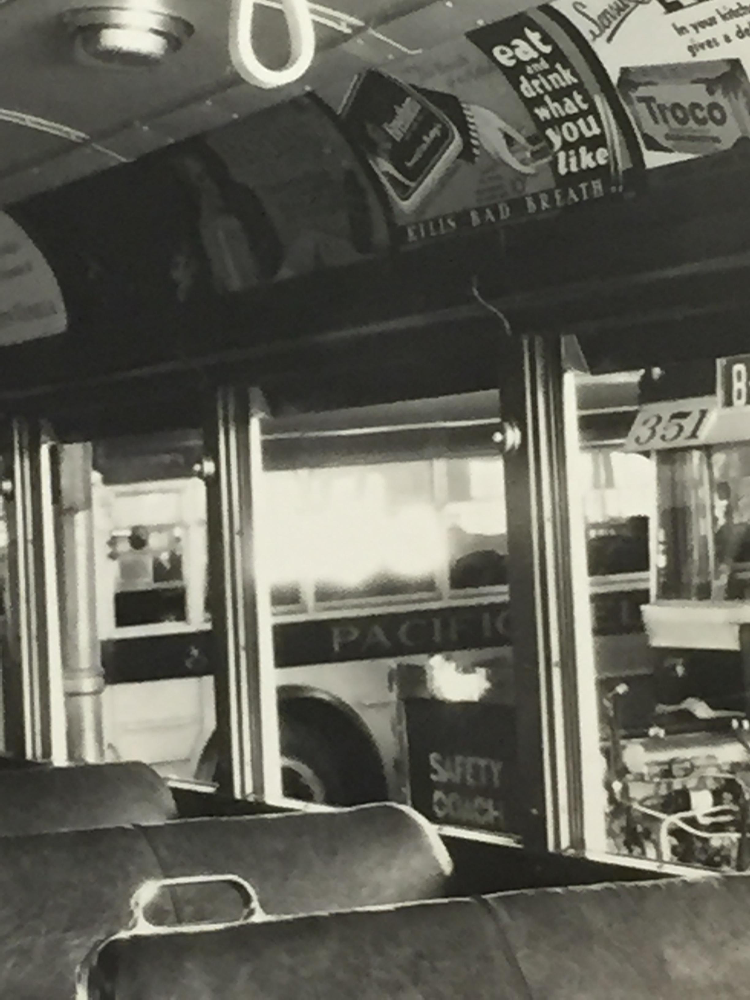

This is a picture of the interior of a Pacific Electric Motor Coach from the 1940s or the 1950s. It was taken in black and white and provides a straight angle shot down the center aisle of the bus. The angle of this shot and the lack of artistic cues leads us to believe that it was taken solely for informational purposes, with no artistic intent. This picture is without a date but we can discern the time period of this photograph from different details within the picture. With seamed black leather seats and metal handles, the interior of the bus reflects the mid-century design. Through the window of the bus we can see an exposed piece of machinery, which makes it evident that this bus was at a depot when the picture was taken. In the background another bus is visible, and the design of its exterior is also clearly from the era of the 1940s or 1950s. The bus has the logo of Pacific Electric Railway, and a sign on the bus says its final destination is East Orange Grove and South Marengo, establishing the bus depot as one of Pacific Electric’s with transit lines into Pasadena. This picture only captures one mode of public transportation in Los Angeles, where there is a long and intricate history of different transportation companies and the different vehicles they incorporated into the constantly expanding community.

For the late part of the nineteenth century and the early twentieth century the streetcar dominated the transportation scene in Los Angeles. Evolving technology molded the shape of the streetcar throughout the years. They started as horse-drawn, but then shifted to cable-powered and then later on to electrically powered. These streetcars were privately owned. Henry Huntington accumulated a great portion of the streetcars in Los Angeles and created the Pacific Electric Building, his company’s first transportation terminal, on 6th and Main in 1905. This building was used for a variety of things including restaurants, ticket sales, and a railway terminal. Later on in his years as owner of Pacific Electric, Huntington’s range of transportation expanded beyond that of streetcars. In 1942, Huntington invested in a $175,000 renovation to create a depot to accommodate for his new fleet of buses. The visual cues within the image of the Pacific Electric Motor Bus, the time frame, and the company of the motor bus suggest the setting is the depot in the Pacific Electric Building.

Years after Huntington’s death the Huntington estate eventually sold Pacific Electric to National City Lines, a Chicago based company notorious for replacing streetcars with motorized buses.  The subsequent company was renamed Los Angeles Transit Lines. Although the switch from streetcars to buses was made to attract patronage, the use of cars and the suburbanization of Los Angeles led to the fall of the bus as well. The Los Angeles County Metropolitan Transit Authority (Metro), purchased all the privately owned transportation routes and vehicles and is reestablishing public transportation in Los Angeles.

The Los Angeles County Metropolitan Transit Authority, established in 1951, was a planning agency tasked with developing a publicly owned system. In 1957, the Metro took over all privately owned transportation companies, including Los Angeles Transit Lines (LATL). Los Angeles Transit Lines, also known as the yellow car system, was established at the end of the second world war and was used to substitute buses on most of the streetcar lines. It functioned mainly around what is now central Los Angeles and had a very high ridership. Around one million people lived within very close proximity to the LATL streetcar and bus lines. In 1946, there were 424 rides per person on the LA Railway, Pacific Electric, and the LA Motor coach; this was the highest transit ridership ever. The acquisition of all these private companies was a boon for the citizens of Los Angeles because it standardized public transportation throughout the city. Yet the rise of the freeways ultimately led to the downfall in ridership for the Metro in the 1960s. Transit ridership reached its lowest point in 1969, where the bus network only handled 96 transit rides per person. Thus, car usage in Los Angeles increased and bus patronage continued to decline throughout the latter half of the 20th century.

**Bibliography**

Wachs, Martin. &quot;Autos, Transit, and the Sprawl of Los Angeles: The 1920s.&quot; Journal of the American Planning Association, 1984.

Walker, Jim. The Yellow Cars of Los Angeles: A Roster of Streetcars of Los Angeles Railway and Successors from the 1890s to 1963. Glendale: Interurbans, 1977.

<figcaption>
Interior of a Pacific Electric Motor Coach

<small>1940s-1950s. Image courtesy of UCLA Library Special Collections</small>

<figcaption>
Magnified view of the outside

<small>1940s-1950s. Image courtesy of UCLA Library Special Collections</small>

<figcaption>
Magnified view of advertisments

<small>1940s-1950s. Image courtesy of UCLA Library Special Collections</small>

