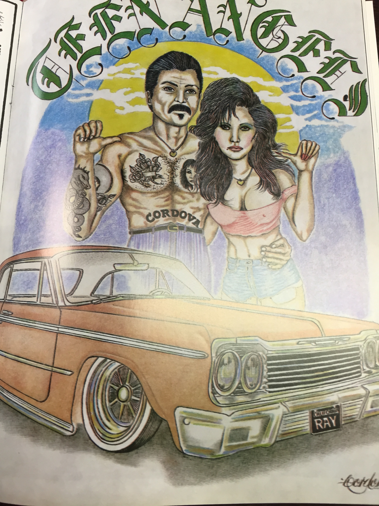

Teen Angels is a self-published magazine based in Northern California that reflects the spirit and culture of gangs in South Central Los Angeles. The couple in the Teen Angels photo seem strong; they are both pictured to be looking straight into the eyes of the reader standing firm behind their 1964 Chevy Impala and displaying their tattoos proudly. It is a perfect example of the Chicano spirit that emerged from the Chicano Art Movement in the 1960s. This spirit prompted gang members and youth to express themselves through art. Teen Angels is a compilation of these voices and depictions of gang culture in Los Angeles.

Teen Angels was first published in 1981 and featured Chicano gang artwork, poetry, graffiti, and fashion. The magazine was inspired by the Chicano Art Movement that became popularized in the 1960s (Garza 1990). The earliest examples of Chicano art were initially just raw posters and banners depicting the struggles of farmworkers and protests over social issues. Chicano art originated in the Southwest and slowly expanded into Southern California. By the end of the 20th century, Los Angeles had become the center of Chicano art due to its large Mexican American population and the large amount of artists working there. The specific art piece from the Teen Angels magazine exhibits the spirit of family and art that came out of the Chicano Art Movement. The movement became popular in Los Angeles in 1965 when Cesar Chavez’s effort to help central-California farmers sparked theater productions that explored Chicano political issues (Garza 1990). The spirit of Chicano rights and justice translated into new forms of protest and social awareness, which is where Teen Angels got its inspiration to start collecting art. According to Margarita Nieto, a professor of Chicano Studies at Cal State Northridge, “[Chicano Art] has a bite to it, an aggressiveness . . . a vitality that comes from this confrontation, living-on-the-edge feeling that is much a part of the aesthetics of contemporary art” (Garza 1990). Teen Angels as a magazine and self-publisher wanted to display the spirit and strength of the Chicanos in America (Ramos 1990). The theme of “resistance and affirmation” of the Chicano people and gangs is evident in the art within the magazine. The art paints the Chicano people to be a family joined together against mainstream culture (Ramos 1990).

Many view these pieces of art in various ways; some say it serves as a glorification of street gangs and their violent lifestyle, while others perceive the artworks as an understatement of the harsh consequences of gang life. Law enforcement officials look at the magazine to find trends between gang members that are used in training courses. This allows them to confirm information on suspected gang members and even help to convict them. According to Ventura County Sheriff's Detective Bill Stevens, “Gangs use it to advertise their philosophy”, allowing them to get recognition for their work which is considered to be an honorable feat (Los Angeles Times 1992). Teen Angels allowed youth to showcase their talent and perspectives on gang culture while also letting the reader create their own viewpoints. The magazine was used as an entertainment and a political reference and created a general stereotype of what gang culture was like in Los Angeles.

The artwork in Teen Angels contains images of beautiful women and customized cars that are created by young gang artists. The artwork is sometimes explicit in its depiction of women; girls with uncensored large breasts are common within the magazine. The image above shows the artist Cordova with a beautiful young women alongside an old fashioned, bright orange car. This piece of art serves as a medium and a voice for people who may not have had a way to get their art out to an audience. Teen Angels offers aspiring young artists a chance to publish their artwork which feature issues that young people experience. With these drawings, they are able to express their viewpoints on gang culture as well as their place within the world.

This image depicts a stereotypical gang-involved couple in Los Angeles. Their style of clothing and explicit tattoos exemplifies their apparent gang affiliation. The man looks like a classic Los Angeles gang member; his tattoos give him a clear edge that sets him apart. It is a classic symbol in gang culture to have one’s name tattooed on himself, which is illustrated in the photo by the man having “CORDOVA” tattooed across his stomach. The way his arm is around the woman’s waist signifies his possession and objectification of women. She is illustrated as more of a possession rather than an equal partner. The fact that the car is placed in front of them suggests their love of highly-priced, material goods. The car is featured just as prominently as the people in the picture, demonstrating gangs’ obsession with material wealth. It also shows their disregard of humanity in society and favor of material gain. With both individuals pointing to themselves in the image, it implies that they are self-centered and primarily focused on their image in society. From the reader’s point of view, being in a gang in Los Angeles means power and wealth. For youth living in South Central Los Angeles, those two ideals are highly sought after and praised. This made gang culture more appealing to youth living in South Central.

Teen Angels illustrates the social and political aspects of gang culture in Los Angeles. The art within the magazine is inspired by the African American and Chicano pride within gang life and Los Angeles. The artwork portrays gang lifestyle to be more positive and appealing to youth. It shows the benefits of being a part of a tight knit community as well as the materialistic gains of being in a gang. The magazine is an outlet for gang members and artists in Los Angeles  to express themselves within a familiar and supportive community. The Chicano Art Movement set fire to a community that created powerful artwork that became Teen Angels.

**Bibliography**

Garza, G. &quot;Chicano visions historic exhibit is the first survey of the art that emerged along with the spirit of a people.&quot; Los Angeles Times, 26 August, 1990.

Joe, Sherry. &quot;Gangs' Paper Trail : Magazines: Teen Angels prints graffiti, art, poetry and obituaries.&quot; Los Angeles Times, 24 March, 1992. 

Kun, J. &quot;Cover story: the new chicano movement.&quot; Los Angeles Times, 9 January, 2005.

Ramos, L. &quot;Touring retrospective examines chicano art.&quot; Los Angeles Times, 30 August, 1990.

<figcaption>
Chicano artwork in Teen Angels Magazine

<small>Milpitas, 1981. Image courtesy of UCLA Library Special Collections.</small>

