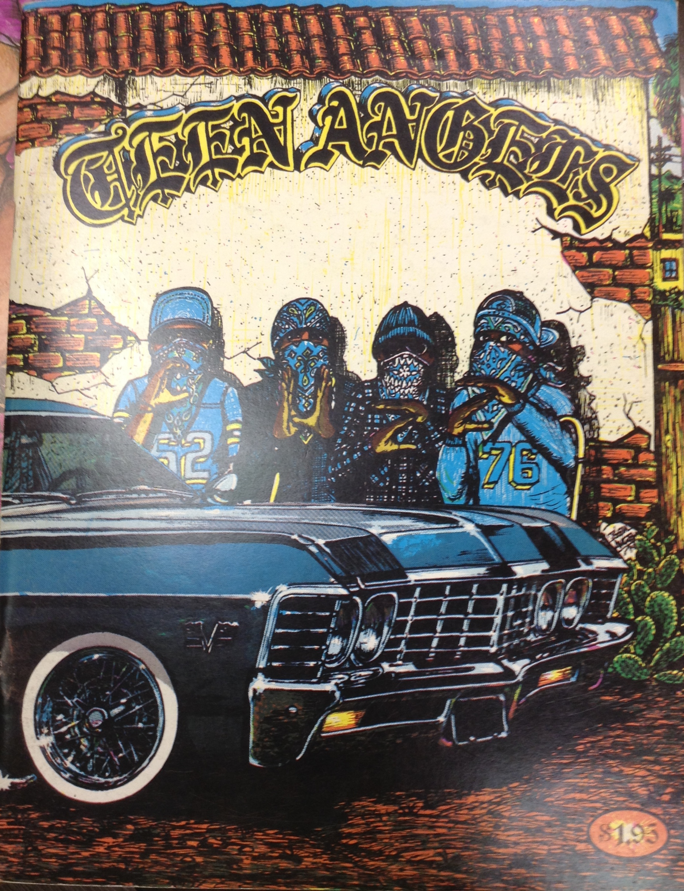
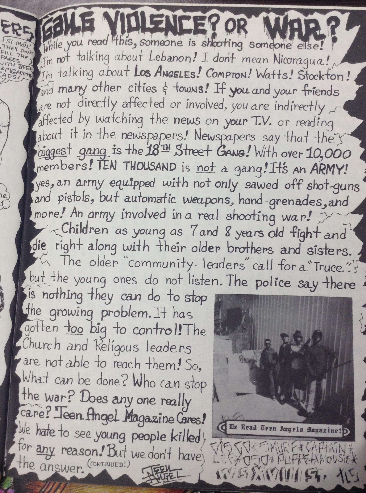
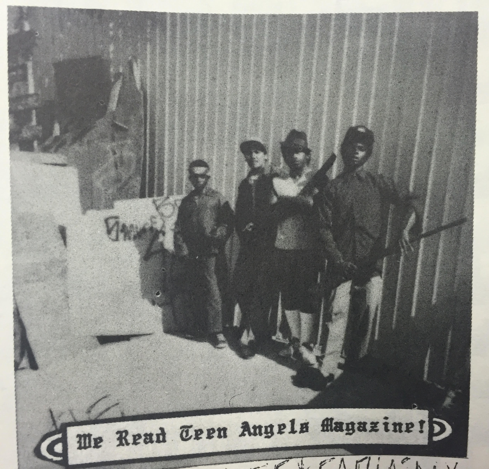

Teen Angels is an art magazine that established the Chicano lifestyle through pictures, poems, and dedications.

David Holland, better known as “Teen Angel”, self published the first issue of Teen Angels in 1981 in Rialto, California. His art expressed his experiences in life, from family traditions to car shows to living in the city (Perez). Many portraits reflect Mexican culture, in addition to the contemporary fads of Chicano teen life. Holland grew up observing Mexican-style murals, which are often rich with detail. He incorporated attention to fine detail into his own art, creating an imagery of life in the Barrio (Perez). In the 90s, Teen Angel retired from the magazine and passed the business on to his sons; however, he was always involved, creating artwork for the medium until his death in early 2015 (Castor). Teen Angel is a legendary artist who is respected, revered, and admired by many.

The appeal of Teen Angels Magazine was that it spoke to the Barrio youth, as it was unfiltered and uncensored. Many contend that the magazine gave the Barrio youth a voice (Joe). The publication functioned like the Internet- it opened up communication as well as updated the people through announcements, anti-gang propaganda and obituaries. The art documented the true nature of the culture, illuminating but not glorifying the violence, gangs, and cholo aspect that is reality for many in the Barrio (Joe). In addition to illustrating women, cars, and graffiti, the magazine focuses on minorities. It covers topics such as relationships, pregnancy, and abortion. Teen Angels is a place where many Chicanos find information and entertainment, from civilians to inmates of Ventura County. Teen Angels served multiple purposes beyond providing entertainment for the community; police often used the magazine as a resource for monitoring gang activity (Joe).

The Teen Angels magazines became a source of advocacy against the stigma of gangs in the late 1990s. The art set a precedent that can now be used to identify gang graffiti in California. There are three styles generally associated with the art community as gang art— block or square letters, loop letters, and point or “homeboy” letters (Cummings 158). The magazine is able to display the specific lettering styles and designs essential to a certain group membership or identity (Cummings 140). Teen Angel not only reproduces the artwork and photographs sent in by current gang members, but also markets specialty items and bands for its adolescent audience. Children often end up joining the gangs featured in the magazine in an attempt to protect themselves from the violence of other gangs. Teen Angels is recognized as a contributing cause of the expansion of gang culture throughout LA (Cummings 158). The magazine has established the extent to which the cultural products of Chicano street gang have influenced Barrio subcultures (Cummings 159). The markings published in Teen Angel demonstrate how the elements of the gang culture have fused with the community (Cummings 164). The magazine proves that there is in fact a distinct connection between the known practices of gangs and the community; in many cases, they are one in the same (Cummings 168).

The 34th edition of Teen Angels Magazine features an anti-violence sentiment about a Los Angeles gang known as 18th Street gang. The notorious 18th Street gang, otherwise known as M-18, ranks as one of the most feared criminal networks in the United States. With over 30,000 members nationwide, M-18 is yet another transcontinental Latino gang (Franco). In the mid 1960s, immigrants moved near downtown Los Angeles in the neighborhood called Pico Union, run by an exclusive Mexican gang called C-14. When these immigrants attempted to join this gang, they were turned away because of race. The non- Mexicans decided to create their own gang named after their home address of 18th Street in Pico Union.

M-18 rapidly began to grow, spreading from coast to coast and taking over all neighborhoods in its path. In 1990, M-18 was ranked as the largest and most dangerous street gang in Los Angeles (Franco). The gang was made up of two- dozen cliques, a Spanish term for set. Acting as a large corporation, the gang rose in success for false I.D. sales, car theft, extortion, firearm smuggling, and narcotics. M-18 gang members were ruthless and did whatever they could to gain respect. The more you said “yes” and the more crimes you committed, the more respect you had and the more valuable you became to the gang (Franco). Many believe that the reason for the success of this gang is because they were nearly all-inclusive. Once you were in, there was only one way to get out and that was by getting killed. M-18 members mostly consisted of poor immigrants who would get bribed into joining the gang because of the wealth and “brotherhood” that was associated with it (Franco). Members would even solicit children as young as eleven to join the gang, promising to protect them in return. Anyone could be a footsoldier, regardless of age, race, or ethnicity.

“La Vida Loca” is a mural located in Los Angeles that was created by the M-18 that depicts the gang in its entirety. It holds portraits of some of the gang’s core members and depicts scenes of violence, death, and imprisonment, while still illustrating freedom, brotherhood, and unity. This mural signifies ownership of the neighborhood and “commands respect” of the gang (Franco); no rival gang has attempted to molest or graffiti over this mural. Just like this mural, Teen Angels Magazine was able to create a space for the Latino gang culture to express themselves and let others see the world from their perspective.

**Bibliography**

Castor, Richard. &quot;RIP TEEN ANGEL.&quot; LA TACO. N.p., 03 Apr. 2015. Web. 23 Nov. 2015.

Cummings, Scott, and Daniel J. Monti. Gangs: The Origins and Impact of Contemporary Youth Gangs in the United States. Albany: State U of New York, 1993. Print.

Franco, Celinda. &quot;The MS 13 and 18th Street Gangs: Emerging Transnational Gang Threats?.&quot; Congressional Research Service, Library of Congress, 2007.

Holland, David. Teen Angels 34 (1984): n. pag. UCLA Library Special Collections. Print.

Joe, Sherry. &quot;Gangs' Paper Trail : Magazines: Teen Angels Prints Graffiti, Art, Poetry and Obituaries. Critics Say It Glorifies the Lifestyle but Doesn't Show the Consequences.&quot; 24 Mar. 1992: n. pag. Print.

Perez, Annemarie. &quot;David Holland.&quot; Introduction to Chicano and Latino Studies. Loyola Marymount University, 3 Apr. 2015. Web.

<figcaption>
Teen Angels, Volume 34 Cover

<small>David Holland, 1984. Image courtesy of UCLA Library Special Collections</small>

<figcaption>
Teen Angels, Volume 34 Anti-gang Sentiment

<small>David Holland, 1984. Image courtesy of UCLA Special Collections</small>

<figcaption>
Teen Angels, Volume 34 18th Street Gang Members

<small>David Holland, 1984. Image courtesy of UCLA Special Collections</small>

