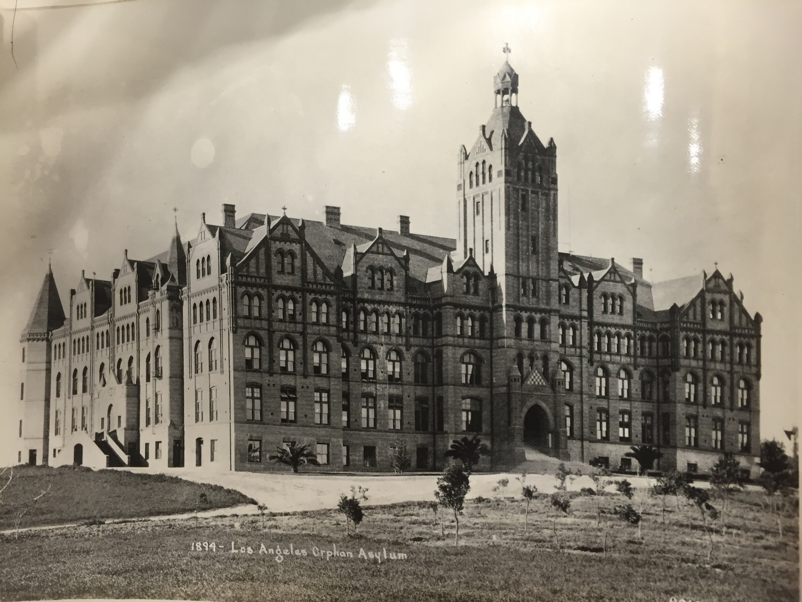

Los Angeles flourished rapidly during the 1800s, after the 1849 Gold Rush. Because of the increase in population, children with deceased parents were left without a place to go. Instead of the abandoned or orphaned wandering the streets, members of the Daughters of Charity created an orphanage, established on January 6, 1856 (Maryvale). 

Bishop Thaddeus Amat, the first of the Monterey/Los Angeles Diocese, petitioned the Daughters of Charity to found a school and orphanage in California. The nuns explored several sites before settling on a nine acre plot given to them by the bishop. Within five years, they extended the property to fourteen acres, a hospital, an academy, a vineyard, an orchard, and a orphanage. They called this orphanage the &quot;orphan asylum&quot; because it was modeled after other institutions the sisters founded. Forty-five of the orphans were enrolled in the sisters' school. Unlike the orphanage pictured, the first establishment was a simple wood-frame house situated where Union Station currently stands. In order to accommodate increasing numbers of children, the Sisters needed to expand the orphanage. In 1869, a second building was built and it was officially called the Los Angeles Orphan Asylum (Maryvale). 

As Los Angeles’ population continued to expand, so did the need for a larger facility. Therefore, a new establishment was built in 1891. The new facility in Boyle Heights is the building featured in the photograph which was taken in 1894. This beautiful building was harmed by earthquake damage, freeway construction, and a population explosion. Even though the orphanage is not located as pictured, the mission still rings true. The asylum provided “a safe place for children of all faiths and races-a refuge in an unstable and sometimes dangerous city” (Maryvale). The Los Angeles Orphan Asylum helped to keep children off the streets by providing a secure space for them to prosper. 

The Los Angeles Orphanage Guild was founded in 1952 and is still active today. The guild originally served as the orphanages financial support system, as time progressed the guild adapted to meet the needs of the people. In addition to funding the facility,  the guild provides activities and mentorships to the girls and young women living under Maryvale’s care. Both Maryvale and the Los Angeles Orphanage Guild strive to prepare the girls for a bright future (The Los Angeles Orphanage Guild). 

Maryvale is no longer an orphanage but a place providing care for foster youth. Their location has moved from Boyle Heights to Rosemead. They provide residential treatment for girls ages 6-17, transitional housing and aftercare for girls 18-21, emergency shelter for children ages 6-12, a family resource center, early education centers and mental health services. In 2014 it was the only organization that provided emergency placement for boys 6-12 in the Los Angeles area, and one of 2 providing placement of girls of the same age group. Their residential treatment center served 137 individuals in 2014 by providing 24-hour care, housing, and mental health services.  In 2014 alone, they helped 1,242 people in total (Maryvale).

**Bibliography**

Photograph Album of Early Los Angeles, Forbes, A.S.C, Mrs. Department of Special Collections, Charles E. Young Research Library, University of California, Los Angeles.

&quot;First Orphanage in Los Angeles.&quot; Maryvale. Maryvale, n.d. Web. 23 Feb. 2016. http://www.maryvale.org/about-us/first-orphanage-in-los-angeles.

&quot;The Los Angeles Orphanage Guild.&quot; N.p.,n.d. Web. http://laorphanageguild.com.

Engh, Michael E., S.J. &quot;Soldiers of Christ, Angels of Mercy: The Daughters of Charity in Los Angeles, 1856-1888.&quot; *Vincentian Heritage Journal*3rd ser. 15.1 (1994):1-27. *DePaul University Libraries.*Web. 1 Mar. 2016. http://via.library.depaul.edu/vhj/vo11/iss1/3.

<figcaption>
Los Angeles Orphan Asylum 

<small> 1894. Image courtesy of UCLA Library Special Collections.</small>

