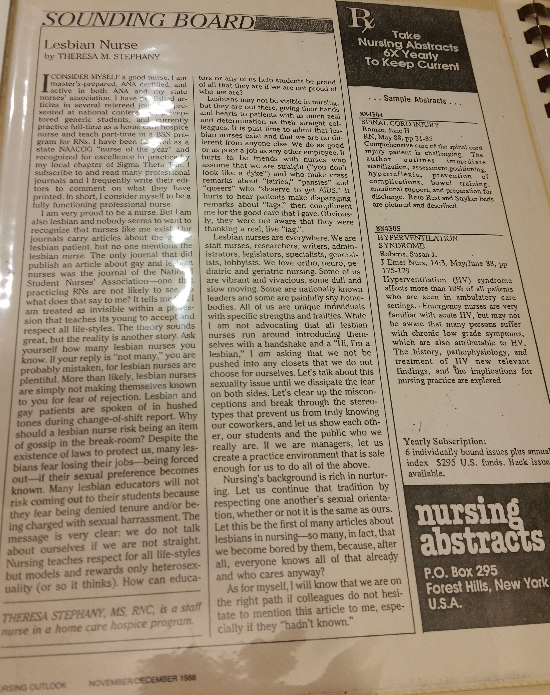

For years, lesbian nurses faced both scrutiny and disregard because of their sexuality. They struggled in home and work life because of discrimination from the heteronormative world. Ultimately, because of criticism at the hands of their fellow co-workers, patients, and loved ones, nurses decided to form a lesbian-specific coalition in the Los Angeles area that referred to themselves as Lesbian Nurses of Los Angeles (LNLA).

Lesbian Nurses of Los Angeles formed in 1985 to support and raise awareness for lesbian nurses. By doing so, this organization also encouraged unity among its members. As part of their mission, LNLA identified issues that affected lesbian nurses and attempted to find ways to fix them. Some of these issues included homophobia, discrimination, and misogyny. To this end, LNLA held monthly meetings in members’ homes to find solutions to society’s discrimination problems and create a discussion about lesbian health care workers. What made this organization distinct was their commitment to activism and community involvement. LNLA participated in various marches and parades, like the Christopher St. West parade. They also actively collaborated with other community groups to help one another.

Although they worked in silence for years, lesbian nurses served patients just as any other nurses would. Lesbian nurses provided patients of all backgrounds with the proper care they needed depending on their state of injury or illness. Nevertheless, when peers or patients found out their sexual orientation, lesbian nurses frequently experienced harassment, verbal abuse, and in extreme cases, onsets of depression. One nurse describes how “she lost many of her friendships with women she had considered ‘close,’ and when she told her parental family ‘my father hired people to take my children’ and she was forced to take them into hiding” (Giddings). As the experiences of these “out” lesbians show, moralistic reactions and silence about their numbers in nursing suggested a double standard: many people claimed to respect the work done by lesbian nurses, but in reality judged and treated them differently because of their sexuality. For many years, homosexual nurses kept quiet about their orientation in order to prevent negatively altering relations with their peers and patients.

As the gay rights movement progressed from its beginnings in the 1960s and homosexuality grew more publicly acceptable, lesbian nurses started to protest the current state of affairs. LNLA brought awareness of the struggles faced by lesbians into the health field. They asserted a right to their open and “out” existence both in the context of nursing and life with their families and peers in general, sharing that they are proud of “being a woman, being a feminist, and being a lesbian.” The article pictured, written by one of LNLA’s very own members, Theresa M. Stephany, says “I am very proud to be a nurse. But I am also lesbian and nobody seems to want to recognize that nurses like me exist.” The women of LNLA focused their efforts on being heard, seen, and respected in their communities by participating in marches, parades, and other public events. But the group also served a more personal function. They acted as a welcoming and friendly environment for lesbian nurses who often felt ostracized in their workplace. By hosting casual monthly meetings in the homes of their members and fostering a sense of community in the group, LNLA was also important as a safe space for its lesbian members.

Unfortunately, LNLA did not last forever, but its ten years of existence was enough of a foundation for other organizations to take its place. The group served as an important support structure for many nurses who faced the difficult reality of life as a lesbian in an unwelcoming environment. As Stephany says in the article pictured, “Let’s talk about this sexuality issue until we dissipate the fear on both sides.” LNLA was important in encouraging people to have this talk. Their parades and public image forced people to acknowledge that the nurses that were saving their lives were also lesbians, and that there was nothing wrong with that!

**Bibliography**

Stephany, Theresa M. &quot;Lesbian Nurse.&quot; Nursing Outlook Magazine Nov. 1998: 295. Print.

Giddings, Lynne S., and Marlaine C. Smith. &quot;Stories of Lesbian In/visibility in Nursing.&quot; Nursing Outlook 49.1 (2001): 14-19. Web.

<figcaption>
Lesbian Nurse

<small>Theresa M. Stephany, 1998. Nursing Outlook Magazine. Image courtesy of UCLA Library Special Collections.</small>

<figcaption>
Lesbian Nurses of Los Angeles pin

<small>Image courtesy of UCLA Library Special Collections.</small>

