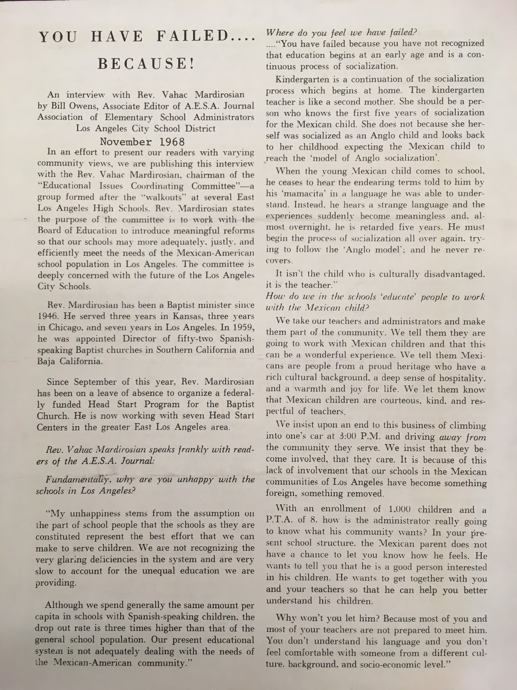
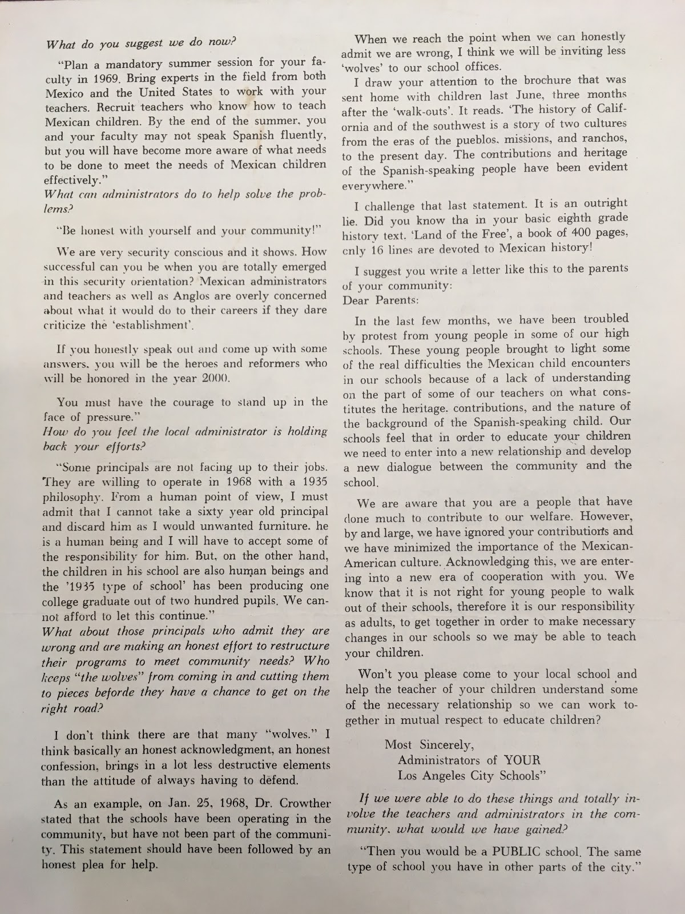

Los Angeles is a place that embodies the American Dream where anyone, regardless of origin, color, or gender, can thrive in an open community, especially within the education system. But such standards were not always embraced. In the 1950s and 1960s, Mexican-American students in East Los Angeles were not provided the resources for an equal education compared to students in West Los Angeles. Their schools did not encourage them to become the best that they could be, but rather, limited their opportunities. This disparity led to the East Los Angeles Walkouts, for which Reverend Mardirosian helped suggest solutions to improve the curriculum, transforming it into what it is today.

It began in the month of March 1968 when multiple Chicano and Chicana students, as well as people who supported them, marched out of Lincoln, Garfield, Belmont, Roosevelt, and Wilson High Schools in East Los Angeles (Walkout DVD commentary, 2006). Soon, thousands--including approximately 2,500 students--were inspired to participate; regardless of their ethnicity and background, they demanded progressive reform of their education system (Harrington, 1968). They did so to demonstrate how unhappy they were with their schools’ poor state and the educational inequality they experienced. They believed that their school administrators set them up for failure by ignoring the needs of the Mexican-American community. Students were not allowed to speak their own language, and were spanked if they were caught doing so. Also, compared to schools in West Los Angeles, East Los Angeles school facilities were run down. Furthermore, their curriculum did not reflect the history of Mexican-Americans and Chicanos in the United States, and instead led to poor employment. Because of these predicaments, the high school students decided to stand up for their rights through the Walkouts (Walkout DVD commentary, 2006). They were encouraged to go to extreme measures such as setting fires in trash cans, breaking windows, boycotting, arson, and even stoning police cars to demand their voices be heard. A particular Mexican-American militant group, referred to as the Brown Berets, disrupted a meeting of the City Board of Education to provide a warning: “If you walk out today, we will walk out tomorrow” (Harrington, 1968). In the 2006 documentary, The Walkout, film producer Moctesuma Esparza explained the reason for the Walkouts: “We wanted a piece of the American apple pie. We wanted a piece of the American Dream….What we wanted was: to get an education. That was what we really wanted, to have the possibility of fulfilling our life’s dreams and goals.” (Walkout DVD commentary, 2006). The students, teachers, and supporters were the first to protest against institutional racism. After several weeks of “the Blowouts,” other protests erupted all across California, the US Southwest, and Texas.

Reverend Mardirosian, chairman of the Educational Issues Coordinating Committee, called for education reform and bravely criticized the system. In an interview with Bill Owens of the Los Angeles City School District in November of 1968, Mardirosian expressed his concern that the system was providing unequal education and neglecting the needs of the Mexican-American community: “Although we spend generally the same amount per capita in schools with Spanish-speaking children, the dropout rate is three times higher than that of the general school population.” He suggested the reason for this problem lay in the school faculty’s misunderstanding of and lack of involvement in the Mexican-American community. Thus, he pointed out, “it isn’t the child who is culturally disadvantaged. It is the teacher.” Mardirosian then suggested that the district hold a mandatory session for teachers to work with both Mexican and U.S. field experts, allowing them to gain the experience needed to address the needs of Mexican students effectively. In addition, he encouraged more to speak out and not to be afraid to criticize the ‘establishment.’ With the implementation of such changes, he was hopeful that success would soon come and the East Los Angeles schools would finally earn the name of true “PUBLIC school[s],” the same kind of schools found in the other parts of the city (Owens, 1968).

Faced with angry students as well as activists like Reverend Mardirosian, the representatives of the Board of Education and Secondary Division staff decided to meet with student representatives for the Los Angeles Unified School District to provide resolutions to their grievances. To prevent further walkouts, the Board of Education came to an agreement with the student population in which they granted demands such as the following: bilingual integration of classes, bilingual instruction, a cafeteria service, the placement of fences around campuses, revision of suspension policies, revision of I.Q. tests to prevent discrimination in the education system, and even swimming pools (Harrington, 1968). The Board agreed to teach conversational Spanish to educators, establishing the East Side Bilingual Study Center, employing 88 bilingual clerks, and assembling workshops to further develop a wholesome understanding of Mexican-American culture and community. The Los Angeles Walkouts served as a necessary step to achieve better communications and interracial relationships between all members of the community and the resources which bring them together as one.

The East Los Angeles Walkouts were not only influential during their time; the effects are still prevalent today. One of the reforms was the development of textbooks and curriculum that “show the Mexican and Mexican-American contribution to the U.S. society” and “the injustices that Mexicans have suffered as a culture of that society.” This holds true today as history classes talk about the history of Mexicans and prominent Mexican figures such as Cesar Chavez. Students continue to follow in the footsteps of the predecessors who walked out; even though they may not do so for the same reason, they rise in protest, similar to the Chicanos back in 1968.

The fight for civil rights goes on today, just as it did with leaders such as Martin Luther King Jr. and Cesar Chavez in the 1960s. Fighting for justice has been important then as it is now. Recently, when President-elect Donald Trump won the Presidency, students from institutions such as USC, UCLA, Berkeley, and several high schools, walked out of their classes and campuses to rally. A great leader is essential when an important modification to a injustice system should be made. During the walkouts students found leaders like Reverend Mardirosian, and Robert Kennedy, who praised their action. Today, acts of protest can go a long way, and with unity, change can happen.

**Bibliography**

Harrington, John H. L.A.'s Student Blowout. N.p.: Phi Delta Kappa International, n.d. PDF. Vol. 50, No. 2 (Oct., 1968), pp. 74-79. Retrieved from: <a target="_blank" href="http://www.jstor.org/stable/20372233" type="url"> http://www.jstor.org/stable/20372233 </a>

Hidalgo, Melissa Martha. (2011). Schooling La Raza : a Chicana/o cultural history of education, 1968-2008. UC San Diego: Literature. b7069243. Retrieved from: <a target="_blank" href="https://escholarship.org/uc/item/8t69s3wd" type="url"> https://escholarship.org/uc/item/8t69s3wd </a>

Inda, Juan J. La Comunidad En Lucha: The Development of the East Los Angeles High School Blowouts. Stanford, CA: Stanford Center for Chicano Research, 1990. Print.

Olmos, Edward J, Leon M. De, Ernie Contreras, Timothy J. Sexton, Victor Villaseñor, Lisa Bruce,  Alexa PenaVega, Michael Peña, Yancey Arias, Laura Harring, Efren Ramirez, David Warshofsky, Jeremy R. Valdez, Jonathan Hernandez, Fidel Gomez, Douglas Spain, Jesse Garcia, Rosino Serrano, and Moctesuma Esparza. Walkout. New York, N.Y.: HBO Video, 2006.

Owens, Bill. &quot;You Have Failed...Because!&quot; A.E.S.A. Journal Association of Elementary School Administrators Los Angeles Unified School District [Los Angeles] Nov. 1968: n. pag. Web.

<figcaption>
YOU HAVE FAILED….. BECAUSE!

<small>Bill Owens, 1968. Image courtesy of UCLA Library Special Collections.</small>

<figcaption>
YOU HAVE FAILED….. BECAUSE!

<small>Bill Owens, 1968. Image courtesy of UCLA Library Special Collections.</small>

