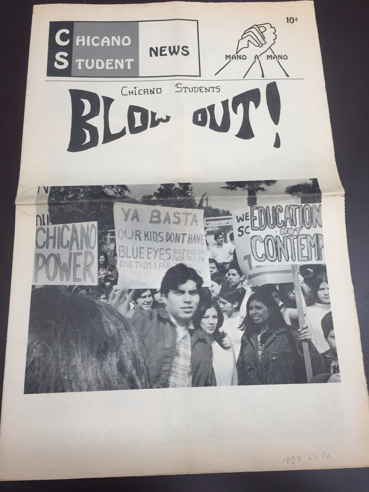
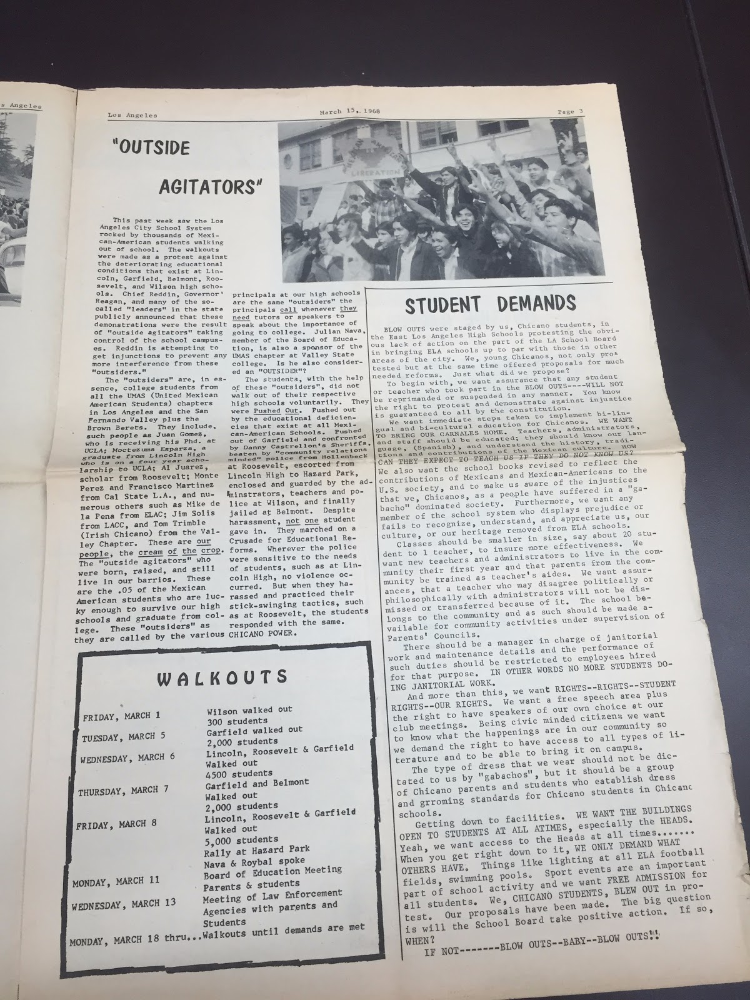

Behind East Los Angeles is a turbulent history of racial tension surrounding the Mexican-American community. In the late 1700s, Spaniards claimed large tracts of Californian land in an effort to colonize the region and use its resources as their own. About a century later, the gold rush ensued and anti-Mexican feelings were in full effect. White men wanted all of the mining profits and excluded immigrants who they felt had no rights to the land (Romo). Racial tensions got progressively worse during World War ll. The war coincided with the Mexican Revolution, prompting many people to flee their homeland for political reasons. It brought even more Hispanics to LA because they were willing to work in the burgeoning war industries for relatively low wages. These workers were pushed to East LA because it was the only area in the region that had affordable housing for the pay that the Hispanics were receiving (Chávez). The homes were usually old and run-down, as the immigrants had little money to spend on the upkeep of their properties. Because the majority of the surrounding LA cities were ritzy and predominantly white, the Mexican-American community was subjected to extreme backlash. In the 1960s, as the push for civil rights was gaining momentum, East Los Angeles became an epicenter for the Chicano movement. Educational inequality soon became a tremendous issue.

The first step towards educational equality started with a teacher named Sal Castro. He, along with student leaders, college students, and groups such as United Mexican American Students (UMAS) and the Brown Berets, developed thirty six demands for the Board of Education.   These requests addressed the issues that they felt affected their education, such as access to bilingual and bicultural instruction (Rebecca Contreras). Since the neighborhoods of East Los Angeles were predominantly hispanic, the students in that area felt that they would learn better if they could be taught in their native language: Spanish.  Additionally, the students demanded that the schools incorporate more Mexican-American history and folklore into their textbooks (Rebecca Contreras).  Many of these pupils identified with the culture of their ancestors as opposed to mainstream curriculum; therefore, they wished to learn their history.  Another request was for the construction of updated school buildings (Rebecca Contreras), including more modern facilities to teach the industrial arts.  Most of the students felt that their outdated resources set them up to work in low-paying jobs for the rest of their lives.  With up-to-date equipment added to their schools they would be more prepared to enter the workforce in modern industries.  The students also demanded that in schools with a majority hispanic population, over half of the administrators and teachers should also be hispanic (Rebecca Contreras).  The Chicano pupils felt that if they had people of the same race to look up to in their schools they would be encouraged to try harder and succeed.  In giving these demands, the students made it clear that they should not be arrested for trying to gain equal education.  They felt that as hispanic students in East Los Angeles they were being treated as second-class citizens, and by trying to obtain a better education they were simply achieving one of their constitutional rights as American citizens.

The board ignored the demands made, so students organized walkouts, which came to be known as “blowouts.” They chose this method of protest in order to hit the school system where it hurt: its wallet. Schools receive funding based on the attendance rate each day, so if students missed class, the school lost money. The first walkout was unplanned, initiated by Wilson High School. Wilson’s principal, Donald Skinner, cancelled the school play, “Barefoot in the Park,” deeming the play unfit for a Mexican-American audience (Rebecca Contreras). This triggered the first walkout, where on March 1, 1968, 300 students walked out of class. The school tried to block the exits, even utilizing police force, but students formed sit-ins and rallies, refusing to go to class until their demands were met. On March 5, approximately 2,000 students walked out of Garfield High School while policemen and administrators attempted to force them back to class. The movement had began and the following day, 2,700 people walked out of Roosevelt and Lincoln, contributing to a total of 5,000 student walkout participants (Chávez). Some Roosevelt students remained locked inside, unable to demonstrate their beliefs. They resorted to climbing fences and were subsequently beaten by police. The use of police force continued to grow. On March 8, Belmont High School attempted a walkout, but students had been so severely beaten by police officers that they had to stop. That same day, students held a rally at Hazard Park; almost 15,000 students showed up to protest and finally prompted a meeting called by the LA Board of Education (Rebecca Contreras).

The Mexican-American community brought their demands to this meeting, hopeful that their wishes would be met. The Board of Education accepted them on March 28, but later claimed that they could not follow through because they did not have adequate funding (Acuña). This was a blow to the Mexican-Americans who believed they had made a significant difference, only to find out later that they did not succeed. Following this failure to enact reforms, more protests ensued, and thirteen of the walkout organizers were arrested. This led the public to change their focus from equal education to the legal defense of the organizers (Raoul Contreras). Because of this shift in focus, equal education for Chicanos faded away from importance. After many years, the number of Latino teachers and administrators has increased and now there are over 6,000 bilingual classrooms in the Los Angeles district (Woo). Even though the walkouts may not have been entirely successful, they created awareness about the inequalities suffered by Chicano students. This large movement unified the East Los Angeles community and remains a symbol of the ability to unite against an unjust system.

**Bibliography**

Acuña, Rodolfo. A Community Under Siege: A Chronicle of Chicanos East of the Los Angeles River, 1945-1975. Los Angeles: Chicano Studies Research Center, Publications, University of California at Los Angeles, 1984. Print.

Chávez, John R. Eastside Landmark: A History of the East Los Angeles Community Union, 1968-1993. Stanford, Calif: Stanford University Press, 1998. Print.

Contreras, Rebecca. &quot;East Los Angeles Students Walkout for Educational Reform (East L.A. Blowouts), 1968.&quot; Global Nonviolent Action Database. Swarthmore College, 24 Apr. 2011. Web. 21 Nov. 2016.

Contreras, Raoul. “The 1968 Walkout Didn’t Matter.” Los Angeles Times. 12 Mar. 2008. Web. 22 	Nov. 2016.

Romo, Ricardo. East Los Angeles: History of a Barrio. Austin: University of Texas Press, 1983. Print.

Vahac Mardirosian Papers, 1964-2007. Collection number 1887. Box 4. Folder 6. Print.

Woo, Elaine. “60s Blowouts: Leaders of Latino School Protest See Little Change.” Los Angeles Times. 7 Mar. 1988. Web. 22 Nov. 2016.

<figcaption>
Chicago Students Blow Out!

<small>Vahac Mardirosian Papers, 1964-2007. Image courtesy of UCLA Library Special Collections.</small>

<figcaption>
Chicago Students Blow Out!

<small>Vahac Mardirosian Papers, 1964-2007. Image courtesy of UCLA Library Special Collections.</small>

