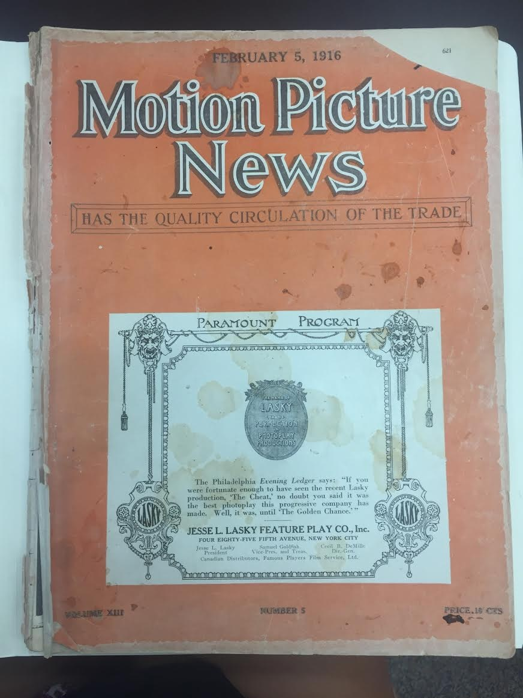
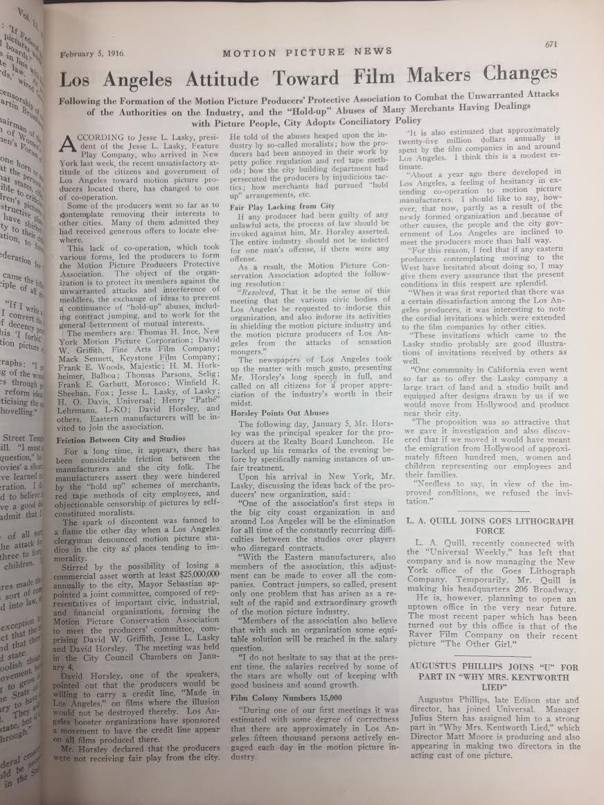

The film industry in Hollywood began in 1913, at the corner of Selma Avenue and Vine Street. At this very location, a barn in the suburbs of Los Angeles acted as a makeshift movie studio where the first feature-length motion picture was produced (Los Angeles, Office of Historic Preservation). The pioneer behind this production, Jesse L. Lasky, and his partners, Sam Goldwyn and Cecil B. DeMille, began the newly developing Lasky Feature Play Company (Hollywood Renegades Archive, Simmp Research Database).  Lasky, inside his run-down barn, paved a path for the development of the American film industry; he along with fellow producers worked closely with the leaders of early Paramount Pictures and became a landmark for the beginnings of cinema (Hollywood Renegades Archive, Simmp Research Database). Henceforth, Lasky’s little barn became the first permanent film company truly located in the town of Hollywood, setting a major precedent for the film industry from there on.

Although Jesse and his colleagues found a path to fame and fortune in the movie industry, they encountered some obstacles along the way. The public and the government targeted Jesse and many other early film producers in ways that made it difficult for the industry to flourish.  The displayed artifact, from 1916, is a collection of articles from an old entertainment Newspaper entitled, The Motion Picture News. The articles include stories of early film and the developing media corporations all across the United States. The featured article, titled “Los Angeles Attitude on Film Making Change,” describes the strained relationship between the city and new studios and how this provoked hostile attitudes and dissention towards the industry. Since the entertainment culture of the time had not fully acclimated to film as a form of media, producers struggled to introduce it in a way that did not offend or shock the public while also allowing merchants and the government to make a profit.

Many of the major Hollywood studios, whom at the time were the foundation of the industry, were facing insurmountable troubles with the task of simply finishing their productions. Some companies were victims to what was referred to as a “holdup” scheme, in which they could not produce their movies because merchants were literally withholding important props needed for certain productions. Some studios found themselves persecuted by the city building department and their bureaucratic red tape, preventing them from building their sets. Even the Los Angeles Police Department took advantage of fledgling studios, forcing them to abide to trivial regulations causing major project delays. The film industry was considered so heinous during that point in history that city government organizations felt as if it was their duty to prevent it from reaching the public eye (Los Angeles Attitude on Film Makers Change, Motion Picture News).

This attack on the new and fragile motion picture industry promoted Lasky and his colleagues to create the Motion Picture Producers Protective Association. With a newly united voice, early studios threatened to take their business out of Los Angeles unless the city government worked with them to provide certain elements of protection. Los Angeles’ mayor at the time, Charles Sebastian, responded by creating the Motion Picture Conservation Association which comprised of multiple key members of the cinema industry including Lasky (Los Angeles Attitude on Film Makers Change, Motion Picture News). This reactionary Association worked together with movie studios and producers to defend their rights while satisfying public demands for censorship. They provided a more standardized form of movie censorship that all studios were equally subject to. If any productions violated city ordinances or these newfound censorship rules, they were now individually prosecuted; the entire industry would no longer fall victim to outlying violations. Additionally, the Conservation Association brokered a deal between the city and Hollywood in which the city would receive attribution for any Los Angeles production as long as city officials stopped their system of greedy holdups and unnecessary bureaucratic red tape. This bolstered the already fruitful city profits of Hollywood while ensuring the protection of movie studios from governmental corruption and highway-robbery (Los Angeles Attitude on Film Makers Change, Motion Picture News).

As a whole, because of the work of Jesse Lasky and the others of the Motion Picture Conservation Association, Hollywood could finally use a system of self-regulation and operate outside of public vilification and legislative corruption. Lasky’s relentless effort on behalf of the Association, took on Los Angeles’ local government for excess cinema profits, giving the studios a more centralized voice to protect their productions from moralist outrage and bureaucratic greed. Due to this, the film industry was given a chance to succeed. Although it pushed the boundaries of modern media, the exposure of the film industry to the city of Los Angeles, which grew to become the cradle of its beginnings, would never have been possible without the fight of Lasky and the Motion Picture Association.

**Bibliography**

Aberdeen, J. A. “Hollywood Renegades: The Society of Independent Motion Picture Producers” SIMMP. Web. Nov. 21, 2016.

Author Unknown, Motion Picture News, “Collection of Motion Picture and Entertainment-Related Periodicals”, February 5th 1916, PASC 266, Box #41, Courtesy of UCLA Library Special Collections.

Couvares, Francis G. “Hollywood, Main Street, and the Church: Trying to Censor the Movies Before the Production Code.” American Quarterly, vol. 44, no. 4, 1992, pp. 584–616. <a target="_blank" href="http://www.jstor.org/stable/2713216" type="url"> www.jstor.org/stable/2713216.</a>

Hilchey, Eugene L. Lasky Studio Barn. Photo. Web. Nov. 21, 2016.

“Los Angeles Historical Landmarks” California State Parks Office of Historic Preservation. Sacramento. 2016. Web. Nov. 21, 2016.

Unknown Author. “Los Angeles Attitude on Film Makers Change.” Motion Picture News 1916 pg. 671.

<figcaption>
Motion Picture News, February 5th, 1916.

<small>Author Unknown, Motion Picture News, February 5th, 1916.  Periodical courtesy of UCLA Library of Special Collections.</small>

<figcaption>
Motion Picture News, February 5th, 1916.

<small>Author Unknown, Motion Picture News, February 5th, 1916.  Periodical courtesy of UCLA Library of Special Collections.</small>

