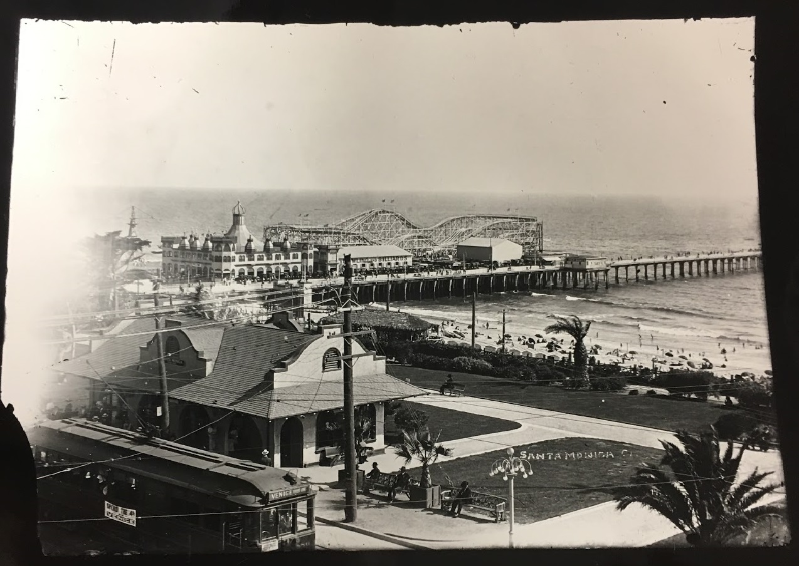

Located at the bottom of Colorado Avenue in Santa Monica, California, the Santa Monica Pier has become a popular destination for tourists and Los Angeles citizens alike. Here, people can experience the Southern California ocean breeze and enjoy amusement rides, street performers, and other recreational activities.  Built for sanitation purposes, the pier has strayed away from its original purpose because of environmental concerns and instead, been entertaining citizens since the grand opening in 1909.

Development of the amusement park began in 1916 with the introduction of roller coasters, such as the Blue Streak, and fun rides that became iconic symbols of the pier’s pleasurable recreation. In the 1930s, the pier saw a boom in new ideas and activities, such as boating, which quickly grew in popularity and allowed for the pier to became home to the Santa Monica Yacht Harbor; however, because of poor construction the pier’s breakwater sank, and the harbor vanished with it.  In its place rose Marina del Rey, a few miles south of the pier. Between the pier and the Marina lay Muscle Beach, home to famous bodybuilders, such as Joe Gold, the founder of Gold’s Gym.  Muscle Beach became an attraction in the 30s and is thought to have paved the way for the physical fitness boom that ensued. Water races and clubs, like paddleboarding and surfing, became extremely popular during this time as well. Throughout the 50s and 60s though, piers across California began closing because theme parks such as Disneyland came into existence.

The Santa Monica Pier remained in operation, but not without difficulties. In 1973, the Santa Monica City Council proposed a plan to destroy the pier and create a manmade resort island. This proposition caused an uproar in Santa Monica and resulted in a petition against such destruction. Although the petition was successful in protecting the pier, brutal storms in 1983 left much of it in catastrophic ruins. After years of construction and community support, the pier was rebuilt in 1990. One of the programs that drew attention to the pier reconstruction was, “Save the Pier Week,” a concert-filled event that still continues to this day. The Santa Monica Pier serves as an integral part of Santa Monica and brings millions of people each year from all over the world. The vision of versatility remains the most important aspect of this historical pier, which offers something for all visitors, whether people enjoy outdoor movies, concerts, or simply the California sunshine.

The Santa Monica Pier has not only been conserved, but it has also developed over time to be more interactive with people. In 1973 Santa Monica beach and pier was opened to people of all color. Together with the  community they formed alliances and committees to fight the city for its restoration.  Since then, the city has built bicycle paths, landscapes, public art, and enhancements to the buildings.  Even today, improvements are still being made to make the pier more entertaining and enjoyable for visitors. Now, the pier holds the Twilight Concert Series every summer and gathers about 200,000 people overall. These concerts are intended to gather the community and enliven the pier.

Time has the ability to change even the most stable of things. Each and every day, historical landmarks and terrains that were established decades ago are improved and renovated for the public’s benefit. The Santa Monica Pier has been one of the many locations that has, over time, changed considerably. In 1983, a $12 million project was put into actiond to restore the pier’s deteriorating foundation that - due to the winter storms of 1983 - was becoming less attractive in the public’s eyes. The storm destroyed about 100,000 square feet of the pier on the western end, which is why 45,000 square feet were planned to be replaced from October through November, even though there had been a grand ribbon cutting of a $1.3 million Carrousel Park that included merry-go-rounds, pavilions, and ramps. These were the first improvements on the Santa Monica Pier since 1911. The point of this restoration was never to raise the pricing of shops and playground, but rather, make a place in which entertainment can be sought at a moderate price and somewhere families can go and enjoy a variety of pleasurable entertainment.

Improvements consisted of: two restaurants, eight fast-food outlets, amusement rides, novelty booths, a theater, and a new 4,000-square-foot building - all within a three year period and with the goal of doubling the 2.5 million visitors that the pier already attracted and make it more commercially developed.  Some buildings no longer served the newly-improved pier, so city officials wished to remove them in favor of parking structures and expanded plaza space. By 1990, the pier had already undergone various phases of the renovation and was reopened to the public; however, it was far from finished. By summer 1991, city planners added more shops and cafes.

To many people, “the pier is the soul of Santa Monica and the further it stretches the more soul we will have” (Stolberg, 1990). Moreover, despite the changes the pier has underwent over the years, the spirit of the pier remains that of recreational versatility. The Santa Monica Pier remains a popular attraction for both tourists from all over the world to residents of the city.

**Bibliography**

C.C. Pierce. Photographic Collection (Collection 1756), Library Special Collection, Charles E. Young Research Library

De Turenne, V.  “L.A. THEN AND NOW; Santa Monica’s heart revolved around it.”  Los Angeles Times, 26 July 2012

Nelson, V. J. “Family; amusements at the pier; old-fashioned fun comes at a modern price at pacific park.” Los Angeles Times, 21 Feb 2002

Palermo, D. (1986, Jun 09). Santa monica pier renewal to retain 'funky' character. Los Angeles Times (1923-Current File): Web. 20 Nov. 2016

Stolberg, S. “Fish are Jumpin as Pier Reopens.” Los Angeles Times (1990, April 07)

Wood, Mikael. “Can the Santa Monica Pier become a great concert venue?” Los Angeles Times, 05 Oct 2013

<figcaption>
Santa Monica Pier 1898

<small>C.C. Pierce.1898. Image courtesy of UCLA LIbrary Special Collections.</small>

