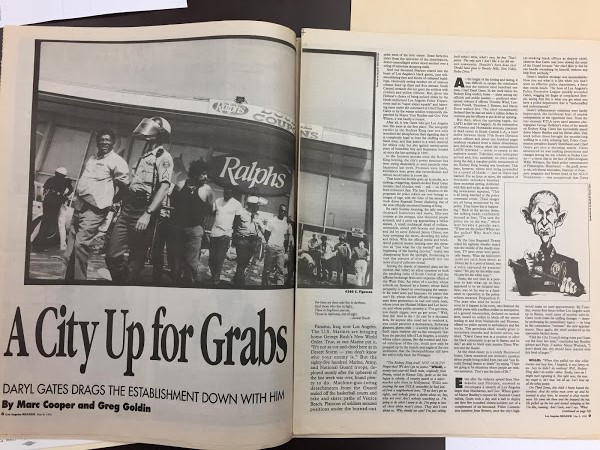

The L.A Riots erupted throughout the city during April 29th, 1992 to May 4th, 1992. They began after Rodney G. King was brutally beaten with batons and tased by four police officers before finally being arrested for speeding. Police assumed that King was under the influence, even though later on it was proven that he was not. King was left with broken bones and teeth, and permanent brain damage. All of this was shown through a videotape by George Holliday, taken from the balcony of his apartment.

The city already had growing tension with the brutality of law enforcement and the use of racial profiling, but this was the first time it was ever caught on tape. Even with evidence excessive force, the four police officers were acquitted of any wrongdoing, because jurors were not convinced that an 81-second videotape of the incident represented the entire story (History).  Hours after the verdicts were announced, outrage and protest turned to violence; rioters in south-central Los Angeles blocked freeway traffic and beat motorists, wrecked and looted numerous downtown stores and buildings, and set more than 100 fires (History).

The unfair verdict fueled frustration and chaos.  Citizens stopped being civilized and became criminals as they took part in acts that would have led them to jail if the city were not so fraught. The six days following the verdict were most detrimental to the city; people burned down their own neighborhoods, looted local stores, and used their second amendment as they bore arms in the streets. When the riots broke out, the first victim to be affected was at the intersection of Florence and Normandie in South Central Los Angeles. A white truck driver got pulled out of his vehicle by four black men, later named the “LA Four”, and beat near death (Whitman, 1993). Although African-Americans played a big role in the LA riots, Mexican, Central American, and Korean immigrants also played a huge role (Bergesen &amp; Herman,1998).

There was racial conflict between each minority, especially between African Americans and Koreans. At the start of the riots, many had already believed that Korean owners were rude, and when a state of pandemonium developed, African-Americans saw Koreans as one of their first targets (Cho,1993). In response to the looting and fires, Koreans who owned their own businesses began to use guns and rifles to shoot anyone who came near their stores. It was at this point that citizens realized the riots were not something to take lightly; curfews were enforced and governor Pete Wilson declared a state emergency by calling National Guard Troops (Mydans,1992).

When the dust settled, 55 people were killed, over 2,000 were injured, and a total of 1 billion dollars worth of damage had been done, making the 1992 LA Riots the largest instance of civil unrest the country had ever seen (CNN). An uproar this massive could not be ignored, and inspired some change within the criminal justice system. The LAPD chief of police, Daryl Gates, was forced to resign in the month following the riots. An independent commission, led by future US Secretary of State Warren Christopher, investigated the systematic racism within the LAPD and uncovered incriminating evidence of police brutality against many citizens (Morris).

While the riots resulted in some meaningful change to the city and its politics, they hardly mitigated the problem. The enormous destruction levied on the city, mainly on the lower-class neighborhoods of South Central LA, required an immense amount of work and money to rebuild (Morris). This money came from both the public and private sectors, but was still not enough to repair all the damage. Further, many believe that these events contributed to an increase in tension between classes and races in the years to come. The short-term impact of the riots seemed like a step forward to alleviate racism, but in the long run it very well might have been a step back.

**Bibliography**

Copper Marc. Goldin Greg. &quot;A City Up for Grabs.&quot; L.A Times. 8 May, 1992, p. 8-9.

Los Angeles Staff. <a href="http://timelines.latimes.com/los-angeles-riots/." target="_blank">“LA Riots: 24 Years Later.” </a>  Los Angeles Times. Apr. 28, 2016. Accessed Nov. 16, 2016.

<a href="http://www.southcentralhistory.com/la-riots.php." target="_blank"> “LA Riots.”</a> South Central History. July 12, 2016. Accessed Nov. 16, 2016.

Morris, Regan. <a href="http://www.bbc.com/news/world-us-canada-17878180" target="_blank"> LA Riots: How 1992 Changed the Police.&quot; </a> BBC News. BBC, 29 Apr. 2012. Web. 28 Nov. 2016.

<a href="http://www.cnn.com/2013/09/18/us/los-angeles-riots-fast-facts/" target="_blank"> &quot;Los Angeles Riots Fast Facts.&quot; </a> CNN. Cable News Network, 8 Apr. 2016. Web. 28 Nov. 2016.

Bergesen, A., &amp; Herman, M. (1998). <a href="http://www.jstor.org/stable/2657476" target="_blank"> Immigration, Race, and Riot: The 1992 Los Angeles	Uprising </a>. American Sociological Review, 63(1), 39-54.

Hodak, G. (2010). King Verdict Ignites LA Riots. ABA Journal, 96(4), 72.

Mydans, S. (1992, May). 11 dead in Los Angeles rioting; 4,000 Guard troops called out as fires and looting continue. (Cover story). New York Times. p. A1.

Whitman, D. (1993). The untold story of the LA riot. (Cover story). U.S. News &amp; World Report, 114(21), 34.

<figcaption>
A city up for grabs

<small>"A City up for Grabs", 1992. Image courtesy of UCLA Library Special Collections.</small>

