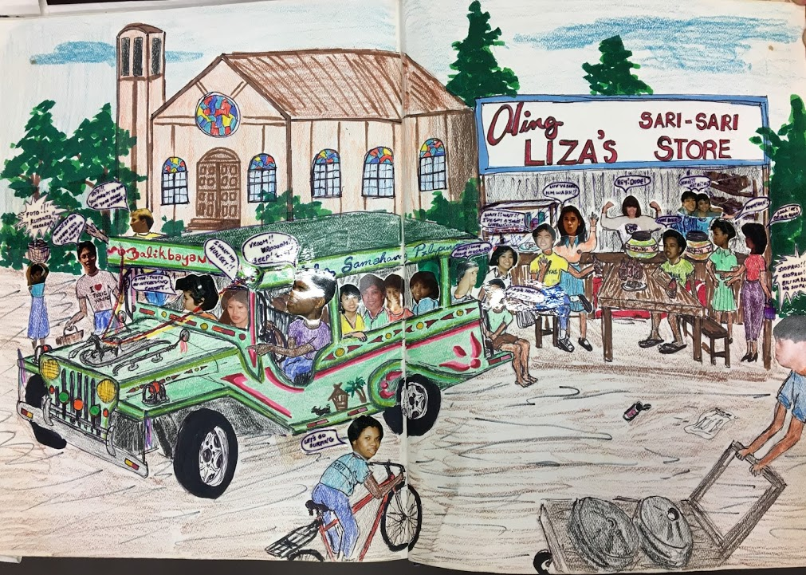

 Filipino Americans make up 4.5 percent of the 41.3 million total immigrant population in the United States today (Batalova and McNamara), but these large numbers were not always the case.

After the Spanish-American war, the Philippines was annexed to the United States in 1898. This decision was made without the consent of the Filipino people, and consequently and rightfully, they resisted American rule. The result was the Philippine-American war, an awful, bloody conflict that ended in 1902 and took as many as 70,000 American and close to 2 million Filipino lives (“Filipino American History”). In the years to follow, Filipino citizens came to the U.S. with little resistance or restriction because of their status as U.S. nationals (Batalova and McNamara). This wave of Filipinos settled mostly in California and Hawaii to take the jobs of displaced Chinese immigrants, whose own migration patterns had slowed because of discrimination and The Chinese Exclusion Act of 1882.

Filipino immigration remained steady and unencumbered until the Tydings-Mcduffie Act of 1934, which limited the number of Filipinos allowed to come to the U.S. to 50 (“Filipino American History”). This restrictive quota system radically decreased Filipino Immigration until World War Two, where Filipino soldiers had been instrumental in helping the Allies fight the Japanese in the Pacific. Following the war, the quota system was doubled to let 100 Filipino people into the country annually, mostly for new service members of the United States Navy and brides returning with American soldiers. (Batalova and McNamara).

It was not until the passing of the Immigration and Nationality Act of 1965, which lifted the restrictive quota system, that Filipino populations rose considerably in the U.S. For example, in a short period of ten years from 1980 to 1990, Filipino population rose by more than half a million people (“Filipino Americans”). This generation of immigrants, filled with artisans, artists and innovators, had a tremendous impact on American society and established the Filipino communities that persist today, especially in Southern California.

Los Angeles, Southern California’s most vibrant and diverse city, became a logical home for this generation of immigrants. Any cultural analysis of Los Angeles must include the impact of Filipinos. Their vibrancy has and will affect the city for many generations to come. Specifically, three criteria illustrate the distinct development of the Filipino community in Los Angeles: occupation, religion, and neighborhood structure.

The working Filipinos in Los Angeles tend to have a background with college education, with 40 percent employed as professionals in their fields (Tiger 24). The priority placed on education leads to upward mobility in the Filipino community. Despite this motivation, it is not always easy for Filipinos in Los Angeles to rise to their full professional potential.  Thirty-six  percent of the population cites that they have faced job discrimination at least once in their lifetime (Tiger 25). Filipinos are not the only minority group represented in Southern California, but this widely-experienced discrimination proves that they are not always accepted into the culture. In terms of religion, the majority of Filipinos are religious, and Los Angeles Filipinos are no exception (Tiger 29). One thing that goes against this fact is the inverse relationship between higher education level and lower religious participation. The Filipinos in Southern California are not the most assimilated demographic. This discrimination is best shown by the statistic that 68 percent of Los Angeles Filipinos live in neighborhoods either mixed or comprised completely of Filipino residents (Tiger 26).

Filipinos in Los Angeles follow some of the normal trends of other minority groups. The biggest of these trends are religious adherence and neighborhood homogeneity.  One of the more individualized traits of the Filipino Angeleno is their educational and economic success. This quality has promoted immigration and strengthened Filipino communities in Los Angeles for the future. For example, a survey conducted in 1978 found that, “Over time, [Filipinos] are more likely to increase their ties to the Filipino community and the general society” (Tiger 68).

Although Asian Americans are now the fastest growing ethnic group in the United States and Filipino Americans represent the highest Asian American population in Los Angeles, the number of these groups is still minuscule, especially when compared to the rest of the nation (“14 Important Statistics”). Fortunately, huge college campuses like UCLA have clubs that nuture minority groups. An excellent example of this is the Filipino-interest ethnic and social club called Samahang Pilipino. Founded in 1972, this massive student organization is a multi-faceted club that focuses on the many aspects of the campus life of Filipino American students at UCLA. Indeed, the club considers cultural, social, political, academic, and community life as five of their key aspects.

As a cultural and social club, Samahang Pilipino commits to engaging their members to the Filipino culture by actively bringing awareness through their guest speakers. Not only that, but their general meetings are also filled with social activities that help create a sense of community within its members. Additionally, its vocal political activism separates it from other student groups from campus. One of their vision statements states that the club “works in solidarity with other communities to transform systems of power in order to achieve justice and equity within and beyond the university.”

Their academic and community focus manifests in two branches: Samahang Pilipino Education &amp; Retention (SPEAR) and Samahang Pilipino Advancing Community Empowerment (SPACE). SPEAR is focused on helping current Bruins of all ethnicities graduate successfully through academic and emotional empowerment. On the other hand, SPACE is reserved for community outreach. This branch mentors high schoolers in historically underserved and underrepresented communities to maximize academic success (About Us - Samahang Pilipino).

All these facets under the umbrella of Samahang Pilipino make for a tight-knit community that calls itself family. A perfect visual depiction of this camaraderie is a picture of “Liza’s Store” from the 1984 Winter-Spring Samahang Pilipino Scrapbook. On the picture is a church and a traditional Filipino store in the back, with a jeepney in the foreground. Scattered all over are cropped pictures of members’ faces pasted on drawn bodies. The image, meticulously hand-drawn by Nario Gavina, highlights the essence of the unity of the group, while showing the many characteristics of authentic Filipino culture.

**Bibliography**

&quot;14 Important Statistics About Asian Americans.&quot; Asian Nation. N.p., n.d. Web. 16 Nov. 2016.

&quot;About Us - Samahang Pilipino.&quot; Samahang Pilipino. N.p., n.d. Web. 16 Nov. 2016.

Balatova, Jeanne. McNamara, Keith. <ref target="http://www.migrationpolicy.org/article/filipino-immigrants-united-states" type="url"> Filipino Immigrants United States </ref>. Migration Policy Institute, 2015.

&quot;Filipino American History.&quot; California State University, Chico (csuchico). N.p., n.d. Web.

“Fillipino Americans” Pew Institute. N.p., n.d. Web

Tiger, Ray Lawrence. The Filipino Community in Los Angeles a Survey of Attitudes and Activities. N.p.: n.p., 1979. Print.

Samahang Pilipino, University Archives Record Series 701, Box 18.

<figcaption>
Liza’s Store

<small>Nario Gavina, 1984. Image courtesy of UCLA Library Special Collections.</small>

