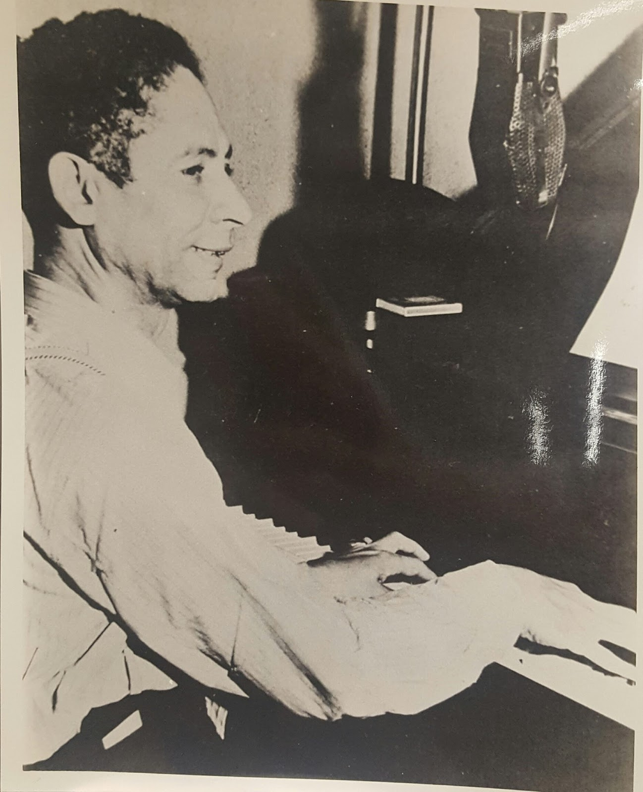

While searching through Miriam Matthews’ photo collection of Black pioneers in California, one might stumble across a of photograph of Jelly Roll Morton. The “creator of jazz” spent some time in L.A. composing a number of jazz hits. The jazz scene of L.A. focused on Central Avenue, an area downtown flourishing with African-American culture. Jelly Roll was a crucial part of the development of jazz in L.A., making him a qualified candidate to be featured in Matthews’ archive. Because of Central Avenue’s integral role in L.A.’s Black community and Jelly Roll Morton’s aid to the musical culture of jazz in L.A., it is important that this history was preserved in Miriam Matthews’ special collection.

While searching through Miriam Matthews’ photo collection of Black pioneers in California, one might stumble across a of photograph of Jelly Roll Morton. The “creator of jazz” spent some time in L.A. composing a number of jazz hits. The jazz scene of L.A. focused on Central Avenue, an area downtown flourishing with African-American culture. Jelly Roll was a crucial part of the development of jazz in L.A., making him a qualified candidate to be featured in Matthews’ archive. Because of Central Avenue’s integral role in L.A.’s Black community and Jelly Roll Morton’s aid to the musical culture of jazz in L.A., it is important that this history was preserved in Miriam Matthews’ special collection.

Miriam Matthews was an African-American historian and activist. She was born in Florida, but moved to Los Angeles as a child. She earned a degree from the University of California at Berkeley and a certificate as a librarian. Miriam became the first African-American librarian in the public library system of California and quickly rose to the top of her field. By the 1940s, she became head librarian and regional librarian in the South Central area. As a proud African-American educator, she sought to organize a collection of artifacts of California’s Black history. She was well-known for her support of African-American artists and co-founded the Associated Artist’s Gallery in 1950 (African American Registry). Throughout her time as a librarian she advocated for civil rights, arts, education, youth, and black history. Miriam became known as “The Dean of Los Angeles Black history.” She was instrumental in gathering documents, photographs, and articles to preserve and share it (Kindig). Her biggest accomplishment was the archive she created of Black pioneers of California from 1781 to the present. The artifacts in the archive serve to mark the importance of African-American history and Miriam’s integral role in preserving these pieces of the past. Her photo collection specifically, which is the artifact we chose to analyze, consists of 4,600 photos dating from the Spanish founding of L.A. to the twentieth century. The collection is another reflection of Matthews’s dedication to the preservation of African-Americans’ past, highlighting civil rights activists, entertainers, government officers, business owners, and organizations formed during this era (Online Archive of California). This photo collection is home to the photo of jazz entertainer, Jelly Roll Morton.

Jelly Roll Morton is the self-proclaimed “Inventor of Jazz.” Known for his big ego and self-confidence, Morton wrote a letter to those that denied him of his self-declared title. In the letter he stated, &quot;New Orleans is the cradle of jazz, and I, myself, happened to be the creator [of jazz] in the year 1902.&quot; (New Orleans and the Creation of Early Jazz). He wrote of his many contributions to the Jazz industry and critiqued those who overlooked him. Though arrogant and contemptuous, Morton was truly one of the original composers of jazz music. He blended “ragtime syncopation with the tonalities and harmonies of the blues” (New Orleans and the Creation of Early Jazz) and in turn helped create early jazz music.

Jelly Roll Morton, formerly known as Ferdinand Joseph Lamothe, was born on October 20th, 1890 in New Orleans, Louisiana. He was the son to racially mixed Creole parents, F.P Lamothe and Louise Monette, who were a mix of African, Spanish, and French. During a time of racial tensions, Morton didn’t define himself through the color of his skin but rather through his abilities. He projected himself as an American, replacing his French last name Lamothe to a more recognized name, Morton and changing Ferdinand, a reference to the Spanish king, to Jelly Roll, a sexual innuendo in African-American vernacular. By doing so Morton created a new American identity that blurred his racial background, and focused more on his music. From 1904 to 1917, Morton left home and traveled to Memphis, St. Louis, Kansas City, and other cities across the country; working as a gambler, pool shark, pimp, vaudeville, and a pianist. During his travels, Morton combined the style of ragtime and minstrelsy with dance rhythms to create a new style of music, jazz. Through the early 1930s Morton was one of the original jazz pianist and composer in New Orleans and in later years Los Angeles. During his time in Los Angeles, Morton composed and produced many jazz hits. After five years in Los Angeles, Morton moved to Chicago in 1922 and produced his first recordings the following year. He composed popular songs such as “Pacific Rag” and “Red Hot Pepper.” In 1926, Morton formed a band called the Red Hot Peppers. The Red Peppers gained national fame with their hits such as “Smoke House Blues” and “Black Bottom Stomp.” Their sound and style became the foundation for the swing movement. Morton’s four-year run with the group marked the pinnacle of his career, as it provided a prominent platform for him to display his immense talents as a composer and pianist.

When the Great Depression hit, Morton fell out of the limelight and struggled to earn a living. In a tragic incident, Morton was stabbed near a whites-only hospital in L.A. He was refused service at the racially segregated facility and transferred to a blacks-only hospital. After the incident Morton suffered from respiratory problems. Years later when he was reestablishing his position in the jazz industry he ended up in dire condition and found himself at the Los Angeles County General Hospital, where he passed away from poor health on July 10th, 1941. Because of his arrogance, few showed up to his funeral. It wasn’t until recently that The Complete Library of Congress Recordings recognized his contributions to the jazz industry. He was inducted to the Rock and Roll Hall of fame in 1998 and honored with a Grammy Lifetime Achievement Award in 2005. At LA jazz festivals, Jazz artists pay tribute to Jelly Roll Morton’s songs and compositions, and of course the “Inventor of Jazz” himself.

Though now somewhat defunct, the Los Angeles jazz scene played a crucial role in the development and popularization of the genre. Just prior to the 1910s, a number of musicians from New Orleans made the move to southern California, bringing with them an early form of the music. Credited to bassist Bill Johnson and his group’s first performances at the Red Feather Tavern, the year 1908 is marked as the genesis of jazz in L.A. In the years following, the movement was expanded by more jazz players, not just from New Orleans but all across the country. One noteworthy event in early L.A. jazz history was the formation of the Original Creole Band, whose national tours helped spread the music before jazz began to be recorded. In the late teens through the 1920’s, jazz clubs, located mostly on Central Avenue, became popular locales for several celebrities of Hollywood’s booming film industry. Interestingly, the technique of jazz itself took some time to develop, and musicians like Jelly Roll Morton helped educate the L.A. natives about jazz style. Since then, L.A.’s jazz scene continued to thrive until the decline of Central Avenue in the 1950s.

Central Avenue is a seven mile stretch located south of downtown Los Angeles. Run over with liquor stores, auto suppliers, and fast-food franchises, this area was famously known as the birthplace of jazz on the west coast. Originally, Central Avenue was populated by Mexicans, Asians, and Europeans. As the African-American population grew larger, it started to bleed in Little Tokyo, where African-Americans would take the housing of Japanese Americans that had been placed in internment camps. As the Black population grew other minorities began moving out. The influx of African-Americans from the South, formed neighborhoods along Central Avenue, an area meant to accommodate 30,000, became home to 70,000 African-Americans by World War II. Another migration of Southern Blacks occurred when the Southern Pacific Railroad Company began to hire workers and their families from the southern states. As the Black immigration to Los Angeles quickened, Central Avenue, which ran parallel to the Southern Pacific line down to Slauson Avenue, became the locus of Black business and recreation. This expansion of the Black community would make Central Avenue one of the largest African-American communities in the United States. Soon, social and artistic life flourished, especially music. This culture produced dozens of nightclubs, including Club Alabam, Downbeat, Surf Club, and the Jungle Room, which became integral venues for the Los Angeles jazz scene. It soon would make this avenue the heart of the African-American community in the city.

Jelly Roll Morton was one of the main influences in the creation of jazz, specifically in Los Angeles. The jazz scene grew out of Central Avenue, which would become a hub for African-American culture in LA. Both Jelly Roll Morton and Central Avenue played a huge part in the development in jazz and in African-American culture. The legacy of Jelly Roll Morton will survive through the collection of Miriam Matthews’ photos.

**Bibliography**

&quot;A King Of Jazz.&quot; American Heritage 45.4 (1994): 107. Academic Search Complete. Web. 19 Nov. 2016.

Bryant, Clora. Central Avenue Sounds: Jazz in Los Angeles. Berkeley: U of California, 1998. Print.

Boyles, Brian, et al. &quot;A Last Look Back.&quot; Offbeat 25.6 (2012): 24-33. Academic Search Complete. Web. 19 Nov. 2016.

Carney, Court. &quot;New Orleans And The Creation Of Early Jazz.&quot; Popular Music &amp; Society 29.3 (2006): 299-315. Academic Search Complete. Web. 19 Nov. 2016.

de Toledano, Ralph. &quot;Jammin' With Jelly Roll, On CD.&quot; National Review 43.5 (1991): 49-53. Academic Search Complete. Web. 19 Nov. 2016.

Dickerson, Dwight. “Jazz in Los Angeles: The Black Experience.” Black Music Research Journal, vol. 31, no. 1, 2011, pp. 179–192.

&quot;Finding Aid for the Miriam Matthews Photograph Collection, 1781-1989.&quot; Online Archive of California. N.p., n.d. Web. 14 Nov. 2016.

Grimes, Teresa. “Historic Resources Associated with African Americans in Los Angeles”. United States Department of the Interior National Park Service. 17 March, 2009.
			   

Jelly Roll Morton, Miriam Matthews Photograph Collection (Collection 1889). UCLA Library Special Collections, Charles E. Young Research Library.

Kindig, Jessie. &quot;Matthews, Miriam (1905–2003) &#124; The Black Past: Remembered and Reclaimed.&quot; BlackPast.org. N.p., n.d. Web. 14 Nov. 2016.

Marmorstein, Gary. “Central Avenue Jazz: Los Angeles Black Music of the Forties.” Southern California Quarterly, vol. 70, no. 4, 1988, pp. 415–426.

&quot;Miriam Matthews, West Coast Historian.&quot; African American Registry. N.p., n.d. Web. 14 Nov. 2016.

Taylor, Jeff. &quot;Nine Priceless Hours With An American Master.&quot; Institute For Studies In American Music Newsletter 36.1 (2006): 9-14. Academic Search Complete. Web. 19 Nov. 2016.

<figcaption>
Jelly Roll Morton

<small>Miriam Matthews, date unknown. Image courtesy of UCLA Library Special Collections.</small>

