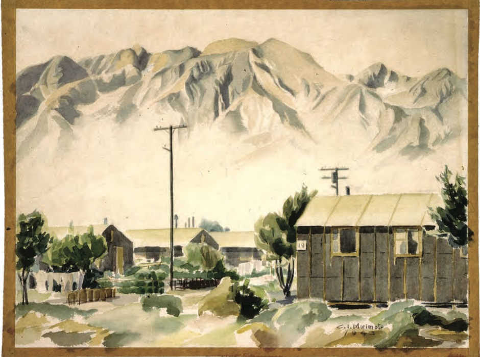

The 1943 painting,“Watercolor of Manzanar,” by C.I. Morimoto is a beautiful portrayal of a widely known relocation camp where over 110,000 Japanese-Americans were incarcerated during World War II. The painting focuses on the houses where the Japanese families had to stay. There is a line of three houses and a bigger one to the side, done so intricately  that even the house number is clearly visible. Adjacent to the largest house is an electricity pole. The illustration shows factory chimneys with the Sierra Nevada and Inyo Mountains rising majestically in the background against the faded blue sky. A blanket of white clouds completely covers the bottom of the mountains, leaving the top exposed. The ridges of the hills are detailed as well. There is a hint of yellow and green on the otherwise silver peaks. There is a contrast between the faded texture of the lower part of the hill and the rough outlines of the summit. The trees and bushes that surround the structure juxtapose the detailed depiction of the house and electric poles. Some of the bushes merge into the brown frame of this aging watercolor. Morimoto depicted infrastructure in the painting exquisitely, yet portrayed the natural environment in an easy fashion.This artistic depiction offers insight into the living conditions of Japanese-Americans in the 1940s.

Manzanar served to incarcerate the Japanese as well as offer a site for their resistance. Located at the foot of the Sierra Nevada in California's Owens Valley, about 230 miles north of Los Angeles, it was built in a wasteland with extremes of heat by day and cold by night (Chiang, 241). Kay Sakai Nakao, who was relocated to Manzanar from Bainbridge Island, Washington, recalled seeing heat waves for the first time, and “men at work, tanned, so Brown [she] didn’t even know they were Japanese” (Chiang, 242). The desert environment was harsh; the absence of any vegetation meant the possibility of terrible whirlwind dust storms, which made the newly arrived Japanese disheartened. To mitigate the heat, dust, and wind, the WRA (War Relocation Authority) allowed the purchase of materials for landscaping -- a strategy that involved the planting of trees and grasses to make the Japanese less susceptible to the destruction of whirlwinds and the unforgiving heat from the sun (Chiang, 243). To enhance the improvised and makeshift buildings, the Japanese took the task upon themselves to work on gardening and revitalizing the relocation camps. They were considered to be some of the best gardeners of the time (Chiang, 248), and their persistent work to improve their prison environment was shown through the composition of numerous gardens (Ladino, 145). By collecting rocks from the Inyo Mountains just East of the camp, replanting trees from saplings provided by the WRA, and obtaining cement in different ways, the Japanese had built in total, no less than dozens, if not hundreds, of gardens (Ladino, 145). These gardens weren’t just for artistic purposes; these prisoners managed to produce around two-thirds of their food. As the original plan to draw water from Shepard Creek proved to be infeasible, private L.A. contractors funded for a reservoir, which the imprisoned Japanese constructed, to ensure that the camps got an adequate amount of water (Ladino, 137). The environment played a vital role in the history of the Manzanar relocation camp by both affecting the experience of the prisoners, but also it was impacted by them.

Today, Japanese-Americans see the Manzanar War Relocation Center as more than a national historic site. Every April, thousands of Japanese-Americans travel there and take part in the Manzanar Annual Pilgrimage. The tradition began in 1969, with only 150 young adults, and has since evolved into an experience that includes spoken word performances, Taiko drumming, speakers, and contemporary bands. It is not only a festival but also a  political forum and religious ceremony. The Japanese-Americans used the Manzanar War Relocation Center as an opportunity to create a new critical faith that embodies the suffering of the Japanese in a positive manner. Although the existence of the Manzanar War Relocation Center is a reminder of their ancestors’ painful history, Japanese-Americans have used  “documents, sites, and rituals of Japanese-American civil religion to help [them] make good of that past” (Iwamura, 96). Today, the Manzanar War Relocation Center is an embodiment of both the pain and the religious beliefs of the Japanese-Americans.

Although Manzanar plays a vital role in the history of Japanese-Americans, their story begins in Little Tokyo. In 1942, the district of Little Tokyo became vacant as Japanese residents and proprietors were forced to evacuate. The area then filled with a large number of African-Americans who came from the southern United States in search of employment. The African-Americans who had moved here were denied housing elsewhere and created a neighborhood of their own called Bronzeville. This area was part of the only 5% of the city which African-Americans were allowed to live in at the time. Because the area was small for so many people, overcrowding became a problem, and it soon became a black ghetto which was near Los Angeles’ City Hall, causing concern among the city’s white population. In 1945, the displaced Japanese internees returned to what was once their ethnic enclave of Little Tokyo. Once the Japanese returned, they and the African-American community worked towards peaceful coexistence; however, Bronzeville/Little Tokyo had failed to cooperate as a result of different relationships with the state politically. Landlords evicted African-Americans. These spaces were then offered to more returning Japanese internees, leading to the demise of Bronzeville. From then on, the district remained Little Tokyo, shaped by its history of migration of the Japanese and African-American communities.

**Bibliography**

Chiang, Connie Y. “Imprisoned Nature: Toward an Environmental History of the World War II Japanese American Incarceration.” Environmental History, vol. 15, no. 2, 2010, pp. 236-267.

Iwamura, Jane. “Critical Faith: Japanese Americans and the Birth of a New Civil Religion.” The Johns Hopkins University Press, vol. 59, no. 3, 2007, pp. 937-968.

Jenks, Hillary. “Bronzeville, Little Tokyo, and the Unstable Geography of Race in Post-World War II

Ladino, Jennifer K. &quot;Mountains, Monuments, and Other Matter: Environmental Affects at Manzanar.&quot; Environmental Humanities, vol. 6, no.1, 2015, pp. 131-57.

Los Angeles.” Southern California Quarterly, vol. 93, no. 2, 2011, pp. 201–235.

Watercolor of Manzanar, War Relocation Center Records (Collection 122, Box 64), Library Special Collections, Charles E Young Research Library, UCLA

<figcaption>
Water color of Manzanar by C.I Morimoto 1943

<small>C.I Morimoto, 1943, Image courtesy of UCLA Library Special Collections.</small>

