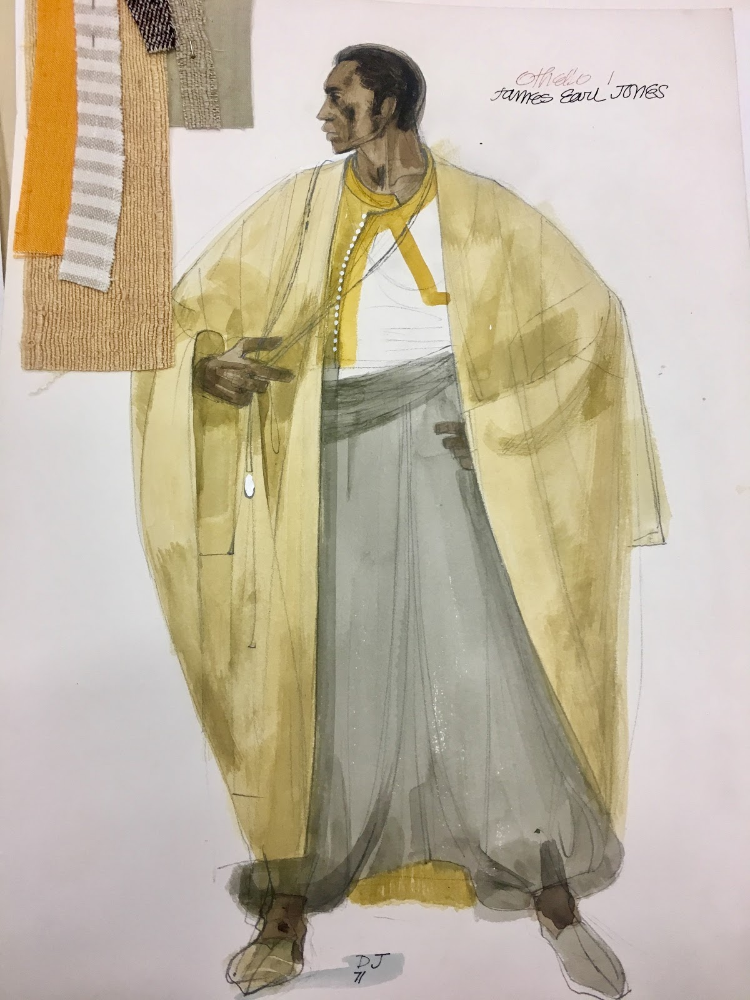

Othello is a tragedy written by William Shakespeare. First performed at the court of King James in the year 1604, it follows Iago, an ensign who hates Othello because he promotes a younger officer, Cassio, to a position above him. Iago deceives Othello and every other character in the play, turning them all against each other for his own benefit. Othello is set in Venice during the latter part of the sixteenth century, a time period in which fashion and costume design played an important role in shaping Venetian culture. Prominent adaptations of the production in film illustrate the significance of Othello’s clothing in defining his character.  In 1922, Dmitri Buchowetzki produced the first film adaptation of Othello, a black-and-white, silent picture that placed the lead character in the spotlight as a man with a powerful presence. The director achieved this by creating an Othello with stand-out features: “Othello’s darkness of skin, his distinctive robe and the concentration of the camera on him set him apart from other characters” (Davies 13). The Venetian populace and the audience admired Othello’s noble attributes. Buchowetzki’s film pertains directly to the themes of the most recent motion picture adaptation of Shakespeare’s Othello, which uses a distinct look to establish the protagonist in a position of power above the Venetians. Oliver Parker’s 1995 Othello shapes the title character’s persona “with a shaved head and a loose-fitting chemise that bring his figure, specifically his facial features, into striking prominence” (Davies 15). Parker and Buchowetzki provide unique interpretations of the Shakespearean play that highlight the importance of costume design and physical appearance in forming Othello’s identity.

The formation of Othello’s identity also occurs through Shakespeare’s use of complex issues facing minorities, which could not be possible without the use of specific costumes and clothing choices. Because Othello was born in Northern Africa, he is labeled by the derogatory term “Moor” to signify his origin. Marcia Macaulay, author of “When Chaos is Come Again: Narrative and Narrative Analysis in Othello,” analyzes the speech of Othello, noting that he is seen as “directive.” (Macaulay 3). Othello’s assertive tone is significant because it is an indication of his willingness to work hard to overcome his position in society as a minority and gain the respect of his comrades.  Othello emulates his persona through a costume that includes faded fabrics and a prominent golden colour that represent his ill-fated resolve to gain power. His passion and determination are striking qualities of his personality, but racial discrimination inhibits the title character from moving up in society. Underneath the faded fabrics of his golden robe, Othello wears a plain white shirt that symbolizes another aspect of his character: his purity and its vulnerable nature. Othello’s vulnerability can be observed primarily in Desdemona’s reported affair with Cassio. In Onesta’s journal, “Theoria: A journal of Social and Political Theory,” the author discusses Rappoport’s article on Othello’s envy towards Desdemona’s infidelity (Onesta 2-4). For example, Onesta reverses Rappaport’s comment that “Othello’s jealousy is founded on something very flimsy” by explaining that Othello is “well-merited,” revealing his vulnerability (Onesta 3). The plain white shirt Othello wears underneath his decorative, golden robe is a symbol for his vulnerable purity hidden by his assertive facade. His emotional characteristics, seen through his love for Desdemona and his trust in his comrades, are a representation of his profound genuineness. All elements of Othello’s wardrobe reveal different sides of his character: his golden attire reflects his desire for power and respect, the faded fabrics of his robe demonstrate his inability to attain these aspirations, and the simple, white shirt shows how even Othello can experience basic human emotions of jealousy and insecurity. Thus, costume design plays an important role in reflecting Othello’s character.

Othello was set in the late 16th century at the height of the wars between the Turks and Venetians. The play begins in Venice, Italy; however, the majority of the play is set in Cypress at a Venetian outpost. In the late 16th century wealth and royalty were shown through fabric choices; upper-class individuals focused their attention on contrasting fabrics, lavish embroideries and trims. Popular fabrics of the time were heavy velvets and brocades covered in extensive embellishments and decorations. “Woven in Italy-particularly Florence, Venice, and Genoa-as well as in Spain, velvets were coveted throughout Europe and also sought after in Turkey, where production demonstrated reciprocal influences, especially with Venetian weaving” (Zrebiec 2). All upper-class Venetian members of the cast in Othello wear these rich velvets with the added weaving although it is interesting to note that at the time of the wars between Venice and Turkey, the Turkish were influenced by the dress of the Venetians and attempting to replicate this fashion. Because of the high price of dyes there was an emphasis on darker colours as they were much easier to replicate. These inexpensive reds, oranges, pinks and blues abounded; however, colours such as yellow proved problematic and extremely expensive to produce and faded quickly.

During the late 16th century the female silhouette showed an increase in skirt and sleeve size with loose gowns usually fitted over petticoats, kirtles or both. The silhouette as a whole gradually widened towards the end of the 1560s, leading to the appearance of smaller waists and larger hips. Desdemona’s silhouette shows this increase in skirt size accompanied by large billowing sleeves. The velvets that proved so important to Venetian society also manifested in the bodice of her deep red dress. Male fashion of the time focused on broad shoulders, which eventually morphed into a narrow line with an emphasis on the V-shape waist. High society would sport hip length embroidered jackets with linen shirts underneath. As a Moor, Othello was dressed in a more traditional manner associated with the Kaftans worn by inhabitants from his region of North Africa. Although yellow proved to be a problematic colour, Othello’s costumes center around a naturally fading yellow to symbolize his existence as a lesser being.

Dorothy Jeakins, renowned costume designer for the production of Othello, was not a stranger to Southern California. Born in San Diego and raised in Los Angeles, Jeakins witnessed art in a variety of forms, particularly theater, film, and television. Her surroundings cultivated her love for costume design, which allowed her to escape from reality and explore her boundless creativity. When designing costumes, she mainly desired to reach her goal of capturing a character’s attitude, persona, environment, and style  (Graham and Fraser 184).  The recognition and praise that she received further highlighted her impressive accomplishments. The Academy nominated her 12 times for a variety of her work, which seemed unusual since, unlike other well-recognized designers, Jeakins never signed with a major motion picture studio  (Van Gelder B18). Jeakins remained genuine about her craft, preferring to invest her efforts into the design rather than Hollywood’s idea of success and fame. She valued the process of creating wardrobes that reflected the characters’ stories. Not only a huge influence in Los Angeles,  Jeakins would soon become an inspiration in the costume design world for decades to come.  Her “strong ties with the theater brought opportunities on both East and West Coasts to work on productions for the American Shakespeare Festival, Los Angeles Civic Light Opera,” and more (Graham and Fraser 184).  As an artist, she pulled from both her inner and outer identity, a style that would permanently inspire future generations.

**Bibliography**

Davies, Anthony. “An extravagant and wheeling stranger of here and everywhere.” Characterizing Othello on Film: Exploring seven film adaptations.” Shakespeare in Southern Africa. 23 (2011): 11-19. Web.

Denmead, Louise. “Early Theatre.” Early Theatre, vol. 10, no. 1, 2007, pp. 152–155.

Dorothy Jeakins Costume Design Archive (Collection 124). Performing Arts Special Collections, Charles E. Young Research Library, UCLA

Graham, Julie, and Megan H. Fraser. &quot;Documenting Costume Design at the UCLA Library.&quot; Performing Arts Resources, vol. 27, 2010, pp. 177-186.

Macaulay, Marcia. “When Chaos is Come Again: Narrative and Narrative Analysis in Othello.”	Style, Vol. 39, No. 3, 2005, pp. 259-276.

Onesta, P.A. “Theoria: A Journal of Social and Political Theory.” No. 15, 1960, pp. 61-63.

Van Gelder, Lawrence. &quot;Dorothy Jeakins Dies at 81; Designed Costumes for Films.&quot; New York Times (1923-Current file), Nov 30 1995, pp. 1. ProQuest Historical Newspapers: The New York Times.

Zrebiec, Alice, et al. “European 16th-19th Centuries.” The Metropolitan Museum of Art Bulletin, vol. 53, no. 3, 1995, pp. 45–58.

<figcaption>
Othello, Senate Scene, Act I-III, Miss Jill Clayburn, Desdemona

<small>Jenkins, Dorothy, 1932-1975. Image courtesy of UCLA Library Special Collections.</small>

<figcaption>
Othello, Act I, James Earl Jones

<small>Jenkins, Dorothy, 1932-1975. Image courtesy of UCLA Library Special Collections.</small>

