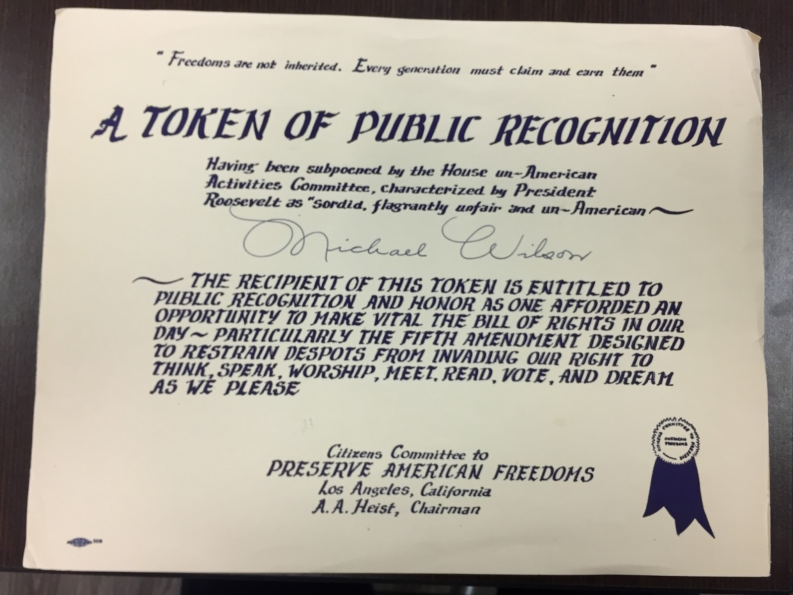

Impaneled by Congress in 1938, the House Un-American Activities Committee (HUAC) investigated Communist advocates and propagandists claiming its goal to maintain national security (Snodgrass 153). It often vilified members of the Hollywood industry and leaked names of whom they were investigating to the press; HUAC focused on the “Communist Infiltration of the Hollywood Motion Picture Industry” (Dmohowski 497). In 1950, because of his involvement with communist groups, Michael Wilson received a subpoena from HUAC to which he publically replied by saying he would not cooperate with the committee. After his announcement, he was fired from his current job. Then, on September 20, 1951, he appeared as a witness before the committee. When asked questions regarding his Communist knowledge and background in the industry, Wilson pleaded the Fifth Amendment and refused to answer the committee. After this hearing, he was blacklisted in the motion-picture industry along with many other screenwriters. In fact, “nearly sixty percent of all individuals called to testify and an equal percent of all those blacklisted were screenwriters” (Dmohowski 498).

In the HUAC hearings of the 1940s and 50s, many bystanders either stood in silence of their own accord or they were intimidated into silence by the House Committee on un-American Activities (HUAC).  The Citizens Committee to Preserve American Freedoms stood apart from the masses.  One of the committee’s important campaigns included a pamphlet called “Courage is Contagious.”  This fifteen-cent leaflet, ensconced in the Special Collections of the UCLA Library, spread the word of truth along with courage to the American people.  The Citizens Committee exposed a number of important faults in HUAC, and provided methods and reasoning for why the American people could not allow HUAC’s actions to continue.

The Citizens Committee notes that HUAC’s members included distasteful characters such as John S. Wood, a democrat from Georgia who voted against investigating the Ku Klux Klan because it was “an old American custom” (Citizens Committee to Preserve American Freedoms 7).  Additionally, the chair of the HUAC, J. Parnell Thomas, was later indicted for stealing government funds (Committee to Preserve American Freedoms 12).  Not only were these men members of one of the most unconstitutional groups in history, but also they were elected officials. The reputation of men like these display why the Citizens mission was imperative to the survival of democracy.

The Citizens Committee also sought to defend the American Constitution, especially the Bill of Rights, from those who would see it manipulated for their personal agendas.  The Fifth Amendment enumerates that no one may be deprived of life, liberty or property without due process of law, nor may they be compelled to be a witness against themselves.  This aspect of the Constitution was most notably under threat.  In his statement, which was suppressed by HUAC, actor Herman Waldman declared that he was “being deprived of the most serious, the most basic property of my life - my right to work…” by the blacklist created with the aid and direction of HUAC (Citizens Committee to Preserve American Freedoms 12).  Since HUAC would simply suppress any statement it deemed unfavorable to their bigoted cause, the Citizens Committee took it upon themselves to support the unfriendly witnesses who were being lambasted by HUAC.

Lastly, to remove any doubt as to the intentions of the House Committee on un-American Activities, the Citizens Committee included a telling quote in their pamphlet from James Colescott, a Grand Wizard of the KKK, “The [Committee’s] program so closely parallels the program of the Klan the there is no distinguishable difference between them” (Citizens Committee to Preserve American Freedoms 22).

Born in McAlester, Oklahoma on July 1, 1914, Michael Wilson grew up in an Irish-Catholic household (Ceplair 188). The Wilsons later moved to the San Francisco Bay Area where he excelled in school. Wilson attended UC Berkeley for his undergraduate studies where he majored in philosophy and minored in English. Over time, he discarded his family’s religious views and found his passion when he started to join student radical groups based on Communism. Wilson then began reading Communist-oriented literature of Karl Marx and Friedrich Engels, which led to his writing of social-realist works. From then on his work was strictly realistic, focusing on “the struggles of modern man” (Ceplair 188). After a year abroad in Europe, he returned to Berkeley to head the organization of the Communist Party branch at the University (Dmohowski 495). Following his strong Communist leanings, Wilson decided he wanted to become a writer that conveyed his belief in “social good” and commitment to Marxism (Ceplair 188). His blend of Marxism and screenwriting was the least to say impressive and the intellectual investment he had developed for these subjects were admirable to many.

Michael Wilson’s career excelled in the late 1940’s to early 1950’s and his work caused him to be noted as “the most accomplished screenwriter of his generation” (Ceplair 187). As a Marxist screenwriter in Hollywood, Wilson believed the content of his work was the most important aspect (Ceplair 189). A few of Wilson’s most rewarding works were A Place in the Sun to the Planet of the Apes, The Bridge on the River Kwai, and Friendly Persuasion. Wilson’s work received multiple nominations including four Writers Guild nominations and five Academy Award nominations. His nominations and awards came from both the United States and the United Kingdom (Ceplair 187).  Bridge on the River Kwai is arguably Wilson's most important work though.  He wrote the screenplay for the film while in he was in hiding in England with another blacklisted writer, Carl Foreman.  Blacklisted writers were ineligible for awards and so when the film won the Academy Award for Best Adapted Screenplay, the award was given to the writer of the original novel, a man who could not speak or read English, Pierre Boulle.  In 1985, the Academy finally posthumously recognized Wilson and Foreman with the Award for Best Adapted Screenplay.

Following his subpoena and vilification at the hands of HUAC, Michael Wilson, one of the blacklisted screenwriters, received a ‘Token of Public Recognition’ from the Citizens Committee.  Having been publicly destroyed by his own industry, Wilson deserved recognition for his efforts in defense of the Bill of Rights, and his eventual forced sacrifice for the cause of Democracy.  If Wilson and many others had not been unjustly blacklisted, and the Citizens Committee had not formed to fight the decisions, people might not have begun to stand up and speak in opposition to the ignorant politicians of HUAC.

A Token of Public Recognition. Michael Wilson Papers, 1942-1977. Image courtesy of [UCLA Library Special Collections].
   {:.caption}

<section id="categories" markdown="1">
**Bibliography**

Ceplair, Larry. &quot;A Marxist in Hollywood: The Screenwriting Career of Michael Wilson (1914–1978).&quot; Historical Journal of Film, Radio and Television 34.2 (2014): 187-207. Web.

Courage is Contagious: The Bill of Rights vs. The un-American Activities Committee. 46, 12.  PASC 52 Michael Wilson papers, 1942-1977. UCLA Special Collections, University of California Los Angeles, Los Angeles.  March 3, 2017.

Dmohowski, Joseph. &quot;The Friendly Persuasion (1956) Screenplay Controversy: Michael Wilson, Jessamyn West, and the Hollywood blacklist.&quot; Historical Journal of Film, Radio and Television 22.4 (2002): 491-514. Web.

Certificate, Box Number 46, Michael Wilson Papers (Collection PASC 52). UCLA Library Special Collections, Charles E. Young Research Library, UCLA.

Snodgrass, Mary Ellen. Civil disobedience: an encyclopedic history of dissidence in the United States. Armonk, NY: Sharpe Reference, 2009. Print.

</section>
