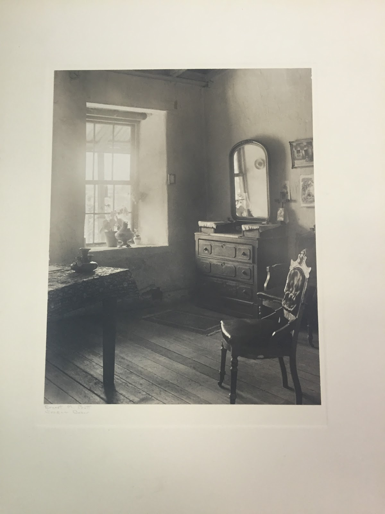

The photograph depicts a room in the Avila Adobe, the oldest home in Los Angeles. This home is located on Olvera Street, the Mexican ethnic enclave that is discussed in this paper. The room remains in traditional style, and has been restored to mirror what the original home looked like when it was built in 1818. Today it serves as a tourist attraction, offering visitors a view of the Mexican architecture and life of the past.

As with other historic districts in Los Angeles, the Mexican ethnic enclave of Olvera Street has come to its current state through its rich history. The origins of the present day enclave, which is located in downtown, just across the way from Union Station, can be traced back to the time of Spanish colonial rule in the early nineteenth-century. By 1821, when the town’s leadership was transferred to the Mexicans, Los Angeles had already been relocated twice “due to the ravages caused by the Los Angeles River” (Estrada 109).  During the period of Mexican rule, certain architectural features, such as the plaza, remained as visible reminders of the prior Spanish government. The area was at the heart of the Mexican community throughout the Mexican-American War and the Gold Rush of the 1850s. By the late nineteenth century, the influx of European settlers caused the plaza to become a forgotten part of the Mexican past. Violence plagued the area, which led the governor at the time to move the center of the town to another location slightly west of the original plaza. A road known as Vine Street was at the heart of this changing landscape. It was this street that in 1877, was renamed Olvera Street after Agustin Olvera, the first judge of Los Angeles County.

At the start of the twentieth century the plaza began to change again, from a state of deterioration, to starting to serve as a hub for Mexican and Italian immigrants. These immigrants brought with them their radical social and political ideas and traditions, transforming the plaza into a meeting place for their respective movements. As tensions began to rise with increased political activism in Los Angeles, “the city council placed a ban on public oratory throughout the city, except for the Plaza, a policy which actually contributed to the vibrancy of public oratory there” (Estrada 110). The 1920s brought an even larger influx of Mexican immigrants to Los Angeles. These immigrants were well integrated into the community, because they served as workers in the agriculture industry. The plaza continued to function as a hub for these migrants, and was an essential part of their community. In spite of the attention the plaza was receiving, it began to deteriorate once more, and this time with it the Avila Adobe, the oldest existing residence in the city.

A central figure in the history of Olvera Street was Christine Sterling, who was regarded as “a symbolic mother figure and guardian of the city’s birthplace” (Estrada 107). The poor state of the Avila Adobe came to her attention and she undertook the task of redeveloping Olvera Street. She also sought to create a tourist attraction out of the plaza. She proposed the renovation of the Adobe to Harry Chandler, the publisher of the Los Angeles Times. Chandler agreed to help by using his position to publicize the plan. But by 1928, because of a lack of financial support, Sterling’s project seemed to be doomed to deterioration, along with the Adobe. When the house was finally condemned by the health department, Sterling used the opportunity to begin renovations. This brought her a significant amount of publicity, and the city soon became heavily involved in renovating the Adobe, as well as turning the plaza into a tourist attraction. Four years later, the Olvera Street we all have come to know today was opened.

Sterling has been credited with saving Olvera Street and the plaza. The street was a very successful tourist attraction, and became known as “A Mexican Street of Yesterday in a City of Today” (Kropp 36). One can find several small vendors along the way selling traditional Mexican goods, such as piñatas, sombreros, and pottery. While from the outside, Olvera Street appeared as a bustling tourist center representative of Mexican culture and history in Los Angeles, it served as a mask over the many social and economic problems faced by Mexicans in the area. The street was created at a time of prevalent anti-Mexican sentiments. The advertised Mexican culture was designed to lure tourists to the area, hence its description of a “theme park-style ‘Mexican marketplace’” (Kropp 35). Although it was Sterling who promoted the building of this attraction, her intentions were pure. She worked towards helping the Olvera Street merchants and furthering their success. She also genuinely appreciated Mexican culture, and because of this, prevented the complete destruction of all Mexican structures in the plaza, especially that of the Avila Adobe.

Olvera Street’s function has changed through the years, from serving as a hub for political activism, to a commercialized representation of Mexican culture and history in Los Angeles. Sterling remains a key figure in preserving the Mexican influence in the area. While the representation of the Mexican culture she fostered can be deemed misleading and fabricated, Sterling’s efforts towards helping the street merchants and her role in the preservation of the Avila Adobe remain essential to the history of Olvera Street and the plaza. These historical aspects have shaped the way Olvera Street functions as an ethnic enclave in Los Angeles today.

<figcaption>
Avila Adobe

<small>Pratt, Ernest Mitchell, 1876-1945. Image courtesy of UCLA Library Special Collections.</small>

<section id="categories" markdown="1">
**Bibliography**

Butler, William B. “The Avila Adobe: The Determination of Architectural Change.” Historical Archaeology, vol. 7, 1973, pp. 30–45.

Avila Adobe, Ernest Mitchell Pratt Collection of Photographs (Collection 1217). Department of Special Collections, Charles E. Young Research Library, University of California, Los Angeles.

Kropp, Phoebe S. &quot;Citizens of the Past? Olvera Street and the Construction of Race and Memory in 1930S Los Angeles.&quot; Radical History Review, no. 81, Fall 2001, p. 34.

Estrada, William D. “Los Angeles' Old Plaza and Olvera Street: Imagined and Contested Space.” Western Folklore, vol. 58, no. 2, 1999, pp. 107–129.

Estrada, William D. Los Angeles's Olvera Street. Charleston, SC: Arcadia, 2006. Web.

</section>